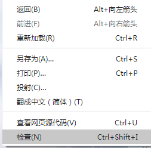
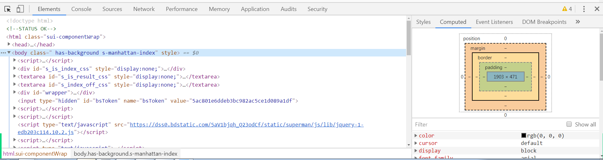

# html 第一天

## 课程要求

上课时间：9：00 ~ 12：30， 2：30 ~ 6：00

晚自习：下午 7：00 ~ 10：00

测试不通过：写3遍，

下午写一遍案例

晚自习写两遍案例

## 一、互联网

### 1.1概述

Web前端三种语言：结构HTML   表现CSS   行为JavaScipt。

​		**HTML**：用来制作网页。

互联网原理：互联网是由许多计算机组成的，并通过网络实现计算机之间数据的传输。

​		上网（打开网页）即请求数据（服务器端的数据，服务器就是计算机）。

浏览器/服务器模型：用户通过在浏览器上输入一个网址，通过HTTP协议向服务器发送请求，服务器

做出响应，将相关的网页数据传输到本地计算机，在浏览器上渲染出来。

数据：文字、图片、视频、音频等。


### 1.2 服务器（Server）

作用：存放我们的数据。

服务器必须24小时在线，掉线了数据访问不到，就不能正常访问网页。

可以通过个人的计算机里面的一些软件（ftp）来远程控制服务器。


### 1.3 浏览器（Browser）

作用：HTTP请求的发起、接收，都是由浏览器来完成的。

浏览器有很多厂商提供，全球五大浏览器：

1. ​	**IE**（Internet Explorer）：Trident内核	（IE Edge 的内核为斯巴达）

2. ​	**火狐**（Firefox）：gecko内核	

3. ​	**苹果**（Safari）：webkit内核	

4. ​	**谷歌**（Chrome）：Blink内核	

5. ​	**欧朋**（Opera）：谷歌blink内核

    由于浏览器内核的差异性，显示原生html会有所差异：

从服务器接收的数据会存放在一个临时的文件夹。接收我们缓存的数据（chrome://version/）

临时文件夹作用：第二次访问同一个网站速度会变快，因为第一次浏览的时候，大部分文件已经缓存

的本地。

### 1.4 HTTP请求

HTTP：Hypertext Transfer Protocol，超文本传输协议。

​		HTTP协议包含了请求和响应两个部分。都是要依赖浏览器。

​		**请求**：request，浏览器根据网址向对应的服务器发送请求。

​		**响应**：response，服务器根据请求响应文件，将页面传输给客户端，在浏览器中进行网页的渲染。

发送HTTP请求的方法：直接输入网址，点击超级链接。

访问页面时，会同时发出多个http请求，包含网页的图片、视频、音频等文件。

### 1.5 浏览器控制台

打开控制台的三种方式：

1. ​	浏览器--> 右键 --> 检查

2. ​	Ctrl + Shift + I		

3. ​	F12(+Fn)

    




浏览器控制台介绍

1. ​	Elements  	查看html基本结构，html标签和html属性

    - ​	Styles    		css样式所在

    - ​	Computed  	计算后的样式

2. ​	Console   		控制台，是用来调试JavaScript代码的

3. ​	Sources   		查看资源文件，如html、css、js、图片文件等等

4. ​	NetWork   	网络请求

## 二、HTML与存文本

### 2.1 存文本

最简单的案例：记事本文件就是纯文本文件。扩展名是.txt。

​		特点：纯文本文件里面只保存文字内容。

与Word文档对比：

- Word 文档：不止保存文本内容，还保存样式。同样的内容，大小要远大于txt文件。
- txt 文件：只保存文本内容，不保存样式。大小只是文字内容的大小。

txt 文件它只能在同一个电脑修改样式，便于本机查看，但是保存的时候，不保存样式。

### 2.2 HTML

html：Hypertext Markup Language。超文本标记语言。作用：用来制作网页。

1. ​	超文本：Hypertext （超出了文本的范畴）

    ​		html 语言用文本来给文本添加语义，用到的文本就叫做超文本。在网页里面不显示

2. ​	标记：Markup （也叫标签），w3c组织规定一些具有特殊意义的字符（英文单词）

    ​		标记存在的意义是提供了语义化

3. ​	语言：Language，语言规范，所有标签用的都是英文。

语义：计算机语言，常人很难读懂，为了让常人读懂，将计算机语言设计的具有语义化。

html标签作用：给我们的文本增加语义，被计算机读懂。标签本身就是超文本。

> 问题：h1标签的作用是什么？

```html
<h1>hello</h1>
<p>hello</p>

```

## 三、开发工具

### 3.1 常用工具

html、css、js都是纯文本文件。

纯文本文件可以用任意的纯文本编辑器进行编辑。

- 最基本的编辑器：记事本。
- 常见的编辑器：记事本、Editplus、notepad++等。

专门制作网页的软件有：

- ​	Dreamweaver								 基础开发工具
- ​	Sublime											高效率程序书写工具
- ​	Webstorm										高级项目编程工具
- ​	Visual Studio Code（VS Code）	高级项目编辑工具（上课使用）

### 3.2 sublime

>  快捷键：

- html:xt|5+tab        		快速生成一个html骨架
- 标签名+tab		              快速生成标签对
- p*数量+tab		             快速生成一定数量的同种标签。
- 按住滚轮拖动       		   选中多行进行同时编辑
- shift+ctrl+↑		             上移当前行
- shift+ctrl+↓		             下移当前行
- ctrl + shift + S 		         另存为
- ctrl + /   			               注释

### 3.3 VS Code

> 快捷键：

- ! | html:5+tab        		    快速生成一个html骨架
- 标签名+tab						 快速生成标签对
- p*数量+tab						快速生成一定数量的同种标签。
- alt+shift+鼠标左键      	  选中多行进行同时编辑
- alt+↑									上移当前行
- alt+↓									下移当前行
- ctrl + shift + S 					另存为
- ctrl + /   							   注释

### 3.4 常见文件后缀

- 文本文档      	.txt			
- 压缩文件    	 .zip/.rar
- word文件    	.doc/.docx		
- 音频文件    	 .wma/.mp3
- excel文件    	.xls/.xlsx			
- 网页文件   	  .html/.htm
- ppt文件    	   .ppt/.pptx		
- 样式文件   	  .css
- 视频文件    	 .wmv/.flv/.mp4/.avi/.mkv	
- javascript文件 .js
- 图片文件   	   .png/.png/. jpg/. gif/. psd/.bmp/.ico

>  显示文件拓展名


### 3.5 DOS 指令

>  查看IP地址  

​	右下角小电脑  打开网络和共享中心 => 更改适配器设置 => 本地链接 => 属性 => IpV4地址

>  DOS查看：

1. ​	Win + R  打开运行
2. ​	输入命令cmd  点击确定
3. ​	ipconfig 点击回车 

>  基本操作：

- ​	cd 		打开目录				
- ​	dir		查看目录内容
- ​	d: 		进入d盘

### 3.6 常见快捷键

- Ctrl + O  		打开新的文件
- Ctrl + N  		新建
- Ctrl + C  		复制
- Ctrl + X  		剪切
- Ctrl + V  		粘贴
- Ctrl + S  		保存
- Ctrl + W 		关闭当前文件
- Alt + F4  		关闭软件
- Win + L  		快速锁定计算机

