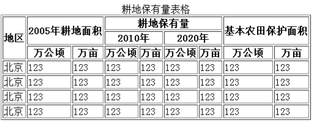

## html 第三天

### 复习

DTD：  html 4: xhtml, html5		strict > transitional > frameset

标签，元素，属性

html

​	head	

​			title

​			base		href， target

​			link		favico.ico

​			meta	charset		name		content		http-equiv

​					seo		keywords， description

​	body

​		属性分类： 

​			特有属性：必选属性，可选属性

​			全局属性（共有）： title, id, class, lang. style

​		h1-h6

​		img	src, alt, 		width, height, border

​		路径：	

​			绝对路径：	本地文件， 线上文件， 本地服务器

​			相对路径：	相对于当前文件： ./   ../   image

## 一、标签介绍

### 1.1 a 标签

一个网站中有很多的页面，页面之间通过超链接进行跳转，超链接可以看做是网页的灵魂。

a 标签是一个双标签，有开始标记和结束标记  ```<a href="#">点我跳转</a>```

属性：

- ​	href 			设置超链接的地址  #代表链接到当前页面或页面的某个位置

- ​	title 			文本提示信息

- ​	rel			规定当前文档与被链接文档之间的关系

- ​	download	规定被下载的超链接目标

- ​	media		规定被链接文档是为何种媒介/设备优化的。

- ​	type			规定被链接文档的的 MIME 类型。

- ​	target 页面的打开方式  属性值 

    ​		_self			当前页面中打开新的页面（新页面覆盖当前页面）

    ​		_blank 		在新的页面中打开（会创建一个新的窗口来打开新页面）

    ​		_parent		页面的父窗口或父框架中打开

    ​		_top			将页面在整个浏览器窗口打开

    ​		framename	在指定的框架中打开页面

### 1.2 锚点

锚点的设置 

​	给标签设置 id属性（要求id是唯一的）

通过另外一个a标签href属性去链接这个锚点，

​	可以链接到当前页面中的指定位置，

​	还可以链接到其他页面的指定部分。

```html
<!-- 外部的页面 -->
<a href="https://www.baidu.com/" target="_blank" title="百度网站">百度</a>
<!-- 只写#,代表打开当前页面 -->
<a href="#">当前页面</a>
<!-- 打开本地文件 -->
<a href="./00 路径.html">本地页面</a>

<!-- 分割线 -->
<hr>
<!-- 进入新闻页面 -->
<a href="./02 锚点.html">新闻</a>
<a href="./02 锚点.html#middle" target="_blank">进入新闻页面的中间位置</a>
<a href="./02 锚点.html#bottom" target="_blank">进入新闻页面的底部位置</a>

<!-- 通过id定义锚点名称 -->
<h1 id="top">顶部</h1>
<!-- h1{标题} + tab  创建的标签包含{}内部的内容 -->
<!-- h1{标题}*10 + tab   创建10个这样的h1 -->
<!-- h1{$}*10 + tab  $代表序号 -->
<h1>1 1 1</h1>
<h1>2 2 2</h1>
<h1>3 3 3</h1>
<h1>4 4 4</h1>
<h1>5 5 5</h1>
<h1>6 6 6</h1>
<h1>7 7 7</h1>
<h1>8 8 8</h1>
<h1>9 9 9</h1>
<h1>10 10 10</h1>
<h1>11 11 11</h1>
<h1>12 12 12</h1>
<h1>13 13 13</h1>
<h1>14 14 14</h1>
<h1>15 15 15</h1>
<h1>16 16 16</h1>
<h1>17 17 17</h1>
<h1>18 18 18</h1>
<h1>19 19 19</h1>
<h1>20 20 20</h1>
<a href="#top">返回顶部</a>
```


### 1.3 div 和 span 标签

div ：容器级标签，（division。 范围、区域、分割）用来划分独立的逻辑块

​	是一个容器（大的区域），本身在网页中没有任何的默认样式，可以放置任何标签和内容。

​	里面可以存放一些相近、相同功能的标签。div会把页面分割成一个小的区域。

span ：文本级的标签，只能放文字、图片、表单元素等，用来修饰部分文本的效果（小的跨度范

围）

​	注：div作为容器，如果没有内容撑起，或者不设置宽高，是没有默认效果

span 标签需要配合后面学的 css 样式使用

​	大的内容放在div里，小的内容放在span。

​	div盒子内容会独占一行，span的内容会写在一行。

```html
<!-- 导航区域 -->
<div>
    <span>hao123新闻</span>
    <span>人民网</span>
    <span>新华网</span>
</div>
<!-- div#idname + tab    创建具有id的元素 -->
<div id="nav">
    <div id="topNav">
        <span>百度•抗击肺炎</span>
        <span>新浪•微博</span>
        <span>搜狐•热点</span>
    </div>
    <div id="bottomNav">
        <span>喜马拉雅FM</span>
        <span>唯品会</span>
        <span>苏宁秒杀</span>
    </div>
</div>
<div id="news">
    <p>24岁姑娘摘下口罩当场大哭 多人中招</p>
    <p>6道菜，疾控专家盯了整整40分钟！</p>
    <p>五一长假患上“节日心理病”?调适指南</p>
    <p>实验表明，每餐少于20分钟风险极大！</p>
    <p>听说草莓连续5年被评为最脏水果？</p>
    <p>"没有绿码，我走投无路了！"</p>
</div>
```


## 二、列表

### 2.1 无序列表

无序列表：给文本添加无序的列表语义。项与项之间没有顺序的先后之分（没有先后顺序）。

- ​	ul	unordered list 无序列表。
- ​	li	list item 列表项。

ul 和 li 这两个标签必须同时出现，不能单独书写。

ul 里可以嵌套一个或者多个 li 标签，但 ul 里面只能放li标签，不能放其他内容。

li 标签是一个典型的容器级标签，可以放置任何的内容标签。甚至可以放置子级ul 与 li。

ul 和 li只能添加无序列表的语义，默认 li 的前面小圆点的样式，

​	我们可以通过 type 属性修改：

- ​		disc 	默认实心圆			
- ​		circle  空心圆				
- ​		square 实心方块

```html
<!-- 无序列表 -->
<!-- ul>li*7 + tab   创建ul以及内部的7个li -->
<ul type="circle">
    <li>24岁姑娘摘下口罩当场大哭 多人中招</li>
    <li>6道菜，疾控专家盯了整整40分钟！ </li>
    <li type="disc">五一长假患上“节日心理病”?调适指南</li>
    <li type="square">实验表明，每餐少于20分钟风险极大！</li>
    <li>听说草莓连续5年被评为最脏水果？</li>
    <li>"没有绿码，我走投无路了！"</li>
</ul>
<!-- ul内部只能写li -->
<!-- <ul>
    <p>hello</p>
</ul> -->
<ul>
    <li>
        <ul>
            <li>第一个列表第一项</li>
            <li>第一个列表第二项</li>
        </ul>
    </li>
    <li>
        
    </li>
</ul>
```


### 2.2 有序列表

有序列表：给文本添加有序列表的语义。

- ​	ol		ordered list有序的列表    
- ​	li		list item列表项。

ol 和 li 也是一组标签，必须同时出现。

ol 里只能嵌套 li 标签。li 不能脱离 ol 自己出现。ol 里可以嵌套多个 li 标签。

li 是一个容器级标签，里面可以放置任何内容，甚至 ol、ul。

虽然显示会有阿拉伯数字排序，但是我们 ol 的作用仅仅是添加有序列表的语义。数字样式不是 ol 的

作用。

ol 元素属性

- ​	 type 		属性设置有序列表的项目符号（ol 有且只有5个）

​		A   大写英文字母		

​		a   小写英文字母		

​		1    阿拉伯数字
​		I    大写罗马数字		

​		i    小写的罗马数字

- ​	start 		设置列表符号从第几个开始排列，属性值只能是阿拉伯数字

- ​	reversed 		设置有序列表项目符号的倒序（html5 新增）

​		这是一个布尔型的属性，关于这类型的属性有两种写法：

​			reversed

​			reversed = “reversed”

注：ul、ol 项目符号不能互相使用；但是li标签可以使用它们任何一个

```html
<!-- 有序列表 -->
<ol start="3">
    <li>小鹿情感平台乱局4891576</li>
    <li>虎门大桥仍振动4248009</li>
    <li>美国确诊超120万4194779</li>
    <li>池子起诉笑果文化4110729</li>
    <li>蓬佩奥父亲去世4061498</li>
    <li>QQ邮箱回应崩溃1231231</li>
</ol>
<ol type="A" reversed start="10">
    <li>小鹿情感平台乱局4891576</li>
    <li>虎门大桥仍振动4248009</li>
    <li>美国确诊超120万4194779</li>
    <li>池子起诉笑果文化4110729</li>
    <li>蓬佩奥父亲去世4061498</li>
    <li>QQ邮箱回应崩溃1231231</li>
</ol>
<!-- 字母顺序小于0出现负数 -->
<ol type="A" reversed start="3">
    <li>小鹿情感平台乱局4891576</li>
    <li>虎门大桥仍振动4248009</li>
    <li>美国确诊超120万4194779</li>
    <li>池子起诉笑果文化4110729</li>
    <li>蓬佩奥父亲去世4061498</li>
    <li>QQ邮箱回应崩溃1231231</li>
</ol>
<!-- 不能使用ul样式 -->
<ol type="circle">
    <li>小鹿情感平台乱局4891576</li>
    <li>虎门大桥仍振动4248009</li>
    <li type="circle">美国确诊超120万4194779</li>
    <li type="disc">池子起诉笑果文化4110729</li>
    <li>蓬佩奥父亲去世4061498</li>
    <li>QQ邮箱回应崩溃1231231</li>
</ol>
<!-- ul不能使用ol的样式 -->
<ul type="A">
    <li>小鹿情感平台乱局4891576</li>
    <li>虎门大桥仍振动4248009</li>
    <li type="i">美国确诊超120万4194779</li>
    <li type="a">池子起诉笑果文化4110729</li>
    <li>蓬佩奥父亲去世4061498</li>
    <li>QQ邮箱回应崩溃1231231</li>
</ul>
```


### 2.3 定义列表

dl 定义列表给我们的文本添加定义列表语义。

- ​	dl		definition list 定义列表  
- 
    ​	dt		definition title定义标题     
- ​	dd		definition description定义描述

dl 里面嵌套了 dt 和 dd。dt 和 dd 是同一级的标签。dd 是对 dt 的解释、说明、定义。

dl 里面只能放置 dt、dd。dt 和 dd都是容器级标签，里面的内容是不限制的。

dl 里面可以放置多组的 dt 和 dd。dt 后面的 dd 可以有多个。这些 dd 都是在解释上面的dt。

dt 后面可以没有 dd，表示没有解释说明。

实际工作中，经常将每一组 dt 和 dd 单独放在一个 dl 标签内部。

```html
<!-- 定义列表 -->
<dl>
    <dt>速度</dt>
    <dd>速度就是路程除以时间的结果。</dd>
</dl>
<!-- 介绍城市 -->
<dl>
    <dt>北京</dt>
    <dd>是我们国家的首都</dd>
    <dd>政治中心，教育中心，医疗中心等等</dd>
    <dd>北京烤鸭，卤煮等等</dd>
</dl>
<dl>
    <dt>上海</dt>
    <dd>东方明珠</dd>
    <dd>经济中心</dd>
    <dd>好吃的很多</dd>
</dl>
<dl>
    <dt>广州</dt>
</dl>
<dl>
    <dt>
        
    </dt>
    <dd>
        <ul>
            <li>这是一位漂亮的姑娘</li>
            <li>非常年轻</li>
        </ul>
    </dd>
    <dt>
        
    </dt>
    <dd>
        <p>这是一只小狗</p>
    </dd>
</dl>
```


## 三、表格

### 3.1 表格基础

table：定义表格容器。

- ​	tr		table rows		定义行
- ​	th 		table head		定义表头
- ​	td		table dock		定义单元格

三层嵌套关系：table > tr > th | td。

最简单的表格要求每一行的单元格个数相同。

如果表格有表头的概念：需要将 td 标签变成 th。

属性：border  设置表格的边框

-   bordercolor 		设置边框的颜色
-   height 、 width  	设置表格的宽高
-   align  			设置表格的整体水平对齐方式  center 居中  left 默认居左  right居右

-   cellspacing 		设置边框与边框之间的距离

-   cellpadding 		设置内容与边框之间的距离
-   background  		设置表格的背景图片
-   bgcolor 			设置表格的背景颜色

-  summary 		表格隐藏信息，用来提高SEO

### 3.2 tr，td 与 th 标签

 tr：行语义，一对 table 标签中有几对 tr 标签，就代表这个表格中有多少行，属性如下：

- ​	align 				设置的当前行单元格中文本的水平对齐方式 left  right  center
- ​	bgcolor、background  	设置背景颜色和背景图片

td(th)：单元格语义，一对tr标签中有几对td(th)标签，就代表当前行有多少个单元格

​	th中的文本具有默认加粗，居中的效果

- ​	bgcolor、background  	设置背景颜色和背景图片
- ​	colspan  				列合并；左右合并
- ​	rowspan 				行合并；上下合并

### 3.3 合并表格

td | th 有两个属性，可以合并单元格。

- rowspan：跨行合并
- colspan：跨列合并

属性值：是几就合并几个单元格。

案例：实现下图表格


```html
<table width="500" height="200" border="1" cellspacing="0">
    <tr>
        <td>1</td>
        <td>2</td>
        <td>3</td>
        <td>4</td>
        <td>5</td>
    </tr>
    <tr>
        <td rowspan="2">6</td>
        <td colspan="2">7</td>
        <!-- <td>3</td> -->
        <td>8</td>
        <td>9</td>
    </tr>
    <tr>
        <!-- <td>1</td> -->
        <td colspan="4">10</td>
        <!-- <td>3</td>
        <td>4</td>
        <td>5</td> -->
    </tr>
    <tr>
        <td>11</td>
        <td colspan="2">12</td>
        <!-- <td>3</td> -->
        <td colspan="2">13</td>
        <!-- <td>5</td> -->
    </tr>
</table>
```


### 3.4 划分区域

表格标题		caption

表头		thead

主体部分		tbody

练习2：实现下图表格。


```html
<!-- 划分表格区域 -->
<table border="1" width="800" height="200" align="center" cellspacing="0">
    <!-- 标题 -->
    <caption>各地区资产投资情况</caption>
    <caption>各地区资产投资情况1</caption>
    <caption>各地区资产投资情况2</caption>
    <caption>各地区资产投资情况3</caption>
    <!-- 表头 -->
    <thead>
        <tr>
            <td rowspan="2">地区</td>
            <td colspan="2">按总量分</td>
            <!-- <td>3</td> -->
            <td colspan="2">按比例分</td>
            <!-- <td>5</td> -->
        </tr>
        <tr>
            <!-- <td>1</td> -->
            <td>自年初累积（亿元）</td>
            <td>比去年同期增长（%）</td>
            <td>自年初累积（%）</td>
            <td>去年同期（%）</td>
        </tr>
    </thead>
    <!-- 主题 -->
    <tbody>
        <tr>
            <td>全国</td>
            <td>12345</td>
            <td>12345</td>
            <td>12345</td>
            <td>12345</td>
        </tr>
    </tbody>
</table>
```


### 3.5 设置标题

表格标题的添加方式：

 1. 使用标题标签 h1-h6

 2. 使用表格自带的标题标签 caption 

    ​	caption 标签必须写在 table 开始标签的后面；

标准中规定，一个表格只能添加一对 caption 标签，也就是只能有一个标题；多个 caption 存在的时

候，浏览器存在兼容性问题：IE 和 Chrome 能全部显示，火狐只能识别第一个

注：表格中一些固定的嵌套

table 一般嵌套 tr，tr 中嵌套 td

只有 td 或 th 可以像 div 那样，作为容器嵌套任何东西

## 作业

实现下面的表格



