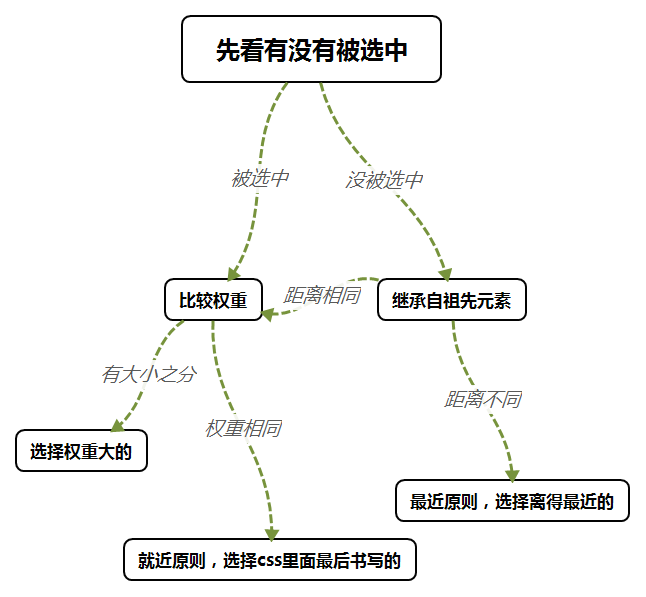

# CSS 第二天

## 复习

引入css，行内式， 内嵌式，外链接，导入式

css：选择器 { 属性名称：属性值 }

选择器：通配符， 标签选择器， id选择器 #， class选择器 .

​	原子类

​	类之间用空格隔开

高级选择器：

​	后台选择器： div p span

​	交集选择器： div.ickt.green

​	并集选择器：div, p, h1

代码规范：

## 一、继承与层叠

### 1.1 继承性

概念：在 css 中，有一些属性，如果给父级元素设置了，那么它的后代元素都将继承这个属性。

​	如：p、h3标签，可以从它的祖先元素中继承了文字的属性，没有继承盒子的属性。

​	注：只有文字的属性能够继承，盒子的属性不能继承。

​	文字属性：color、font-系列、line-系列、text-系列。

​	盒子属性：background-系列、width、height、border-系列、浮动、定位等。

通过控制台查看继承的属性：Elements 面板 => Style 选项卡，即可查看继承的属性

CSS 的继承性是一个很好的语言特性。

作用：可以简化 css 代码，有的属性可以设置给 body，body 内部的标签都会继承这个属性。

层叠性体现：css 的继承性。

```html
<!DOCTYPE html>
<html lang="en">
<head>
    <meta charset="UTF-8">
    <meta name="viewport" content="width=device-width, initial-scale=1.0">
    <title>Document</title>
    <style>
        /* 通过继承性来统一设置样式 */
        body {
            /* 文字属性可以继承 */
            color: red;
            /* 盒子属性不能继承 */
            height: 100px;
        }
        /* h1 {
            color: red;
        }
        p {
            color: red;
        } */
    </style>
</head>
<body>
    <h1>爱创课堂</h1>
    <p>爱创课堂</p>
    <div>爱创课堂</div>
</body>
</html>
```


### 1.2 选择器权值

权值：选择器的针对性越强，权值越高。

​	权值排序：!important > 行内样式 > id > 类 | 伪类 | 属性 > 标签 > 通配符。

针对同一个元素标签，当设置了不同的选择器时，要判断权值的大小，权值越大优先级越高；基本选

择器权值如下：

| **选择器**            | **权值** |
| --------------------- | -------- |
| 继承，通配符等        | 0.1      |
| 标签选择器            | 1        |
| 类选择器,伪类，属性等 | 10       |
| id选择器              | 100      |
| 行内使用style属性     | 1000     |
| !important重要性      | 无穷大   |

注：某些浏览器下：1个类选择器 = 255标签选择器，1个ID选择器 = 255个类选择器

### 1.3 计算权重

权重：就是对选择器组合后的权值求和，权重越高使用样式的优先级越大。

权重的计算方法：比较id、类、标签的数量。依次比较，如果id的数量多，就权重最大。如果id的数

量相同，比较类的数量，类多的权重大。如果类的数量也相同，比较标签的数量，标签多的权重大。

标签还相同，那么看css里面的书写顺序，根据就近原则，此时会优先使用离元素最近的选择器（最后

书写的）。

​	即：如果权重相同，最后出现的就是我们显示的。

层叠性：针对同一个元素标签，当设置了不同的选择器时，，权重高的层叠掉权重低的样式。

注意：比较权重的时候，一定要让选择器作用到元素上。

```html
<!DOCTYPE html>
<html lang="en">
<head>
    <meta charset="UTF-8">
    <meta name="viewport" content="width=device-width, initial-scale=1.0">
    <title>Document</title>
    <style>
        /* id 斤， 类 两，  标签 钱 */
        /* 3钱 */
        /* div p strong {
            color: red;
        } */
        /* 1两1钱 */
        /* .demo strong {
            color: green;
        } */
        
        /* 比较权重的时候，一定要让选择器作用到元素上。 */
        #ickt strong {
            color: pink;
        }
        /* #ickt {
            color: pink;
        } */
        /* 权重相同优先显示后面的绿色 */
        /* 1两2钱 */
        .demo p strong {
            color: red;
        }
        div.demo strong {
            color: green;
        }
    </style>
</head>
<body>
    <div id="ickt">
        <div>
            <div class="demo">
                <p>
                    <span>
                        <strong>爱创课堂</strong>
                    </span>
                </p>
            </div>
        </div>
    </div>
</body>
</html>
```


### 1.4 !important

特殊的关键词。!important。

​	直接写在 css 样式后面，来提高权重（权重最大）

 	如果选中了元素，它的权重最高。

 	如果没有选中元素，它不会影响就近原则。

​	如果在多个选择器中使用，会受到选择器权重的影响。

!important 只针对是单个 css 属性，而不是一个选择器。

```html
<!DOCTYPE html>
<html lang="en">
<head>
    <meta charset="UTF-8">
    <meta name="viewport" content="width=device-width, initial-scale=1.0">
    <title>Document</title>
    <style>
        /* 多个选择器设置!important，要考虑选择器的权重 */
        /* #ickt strong {
            color: pink!important;
        }
        #ickt {
            color: gold!important;
        }
        .demo p strong { */
            /* 权重是最大的 */
            /* color: red!important;
        }
        div.demo strong {
            color: green!important;
        } */

        /* 选中最外层div */
        #ickt {
            color: pink!important;
        }
        /* 选中的是p */
        .demo p {
             color: red!important;
        }
        p {
            color: blue!important;
        }
        /* 选中的是具有demo类的div */
        div.demo  {
            color: green!important;
        }
    </style>
</head>
<body>
    <div id="ickt">
        <div>
            <div class="demo">
                <p>
                    <span>
                        <!-- <strong style="color: blue;">爱创课堂</strong> -->
                        <!-- <strong style="color: blue!important;">爱创课堂</strong> -->
                        <!-- 去离得最近的父元素上继承样式 -->
                        <strong>爱创课堂</strong>
                    </span>
                </p>
            </div>
        </div>
    </div>
</body>
</html>
```


### 1.5  层叠性

层叠性：多组选择器的样式可以作用在同一个元素上。

​	如果选中了这个元素。计算选择器的权重。

​		比较的是选择器离目标元素的距离。距离近的就是我们继承的属性。

 如果没有选中元素，看继承性。

 		注：如果没有选中，也有权重，权重为0.不能进行权重的比较。

​		如果没有选中目标元素，样式靠继承。遵循就近原则。距离不同，谁离的目标元素近，选谁的。

​	如果距离相同，就需要再次比较权重。权重高的是被选择。

​		距离相同，权重相同，谁写在最后面听谁的（就近原则）。

​	两种情况要记清：



​	注：如果是并集选择器，需要拆开来看。

```html
<!DOCTYPE html>
<html lang="en">
<head>
    <meta charset="UTF-8">
    <meta name="viewport" content="width=device-width, initial-scale=1.0">
    <title>Document</title>
</head>
<body>
    <style>
        /* 并集选择器拆开看 */
        body,
        h1 {
            color: red;
        }
        /* 拆开的结果 */
        /* body {
            color: red;
        }
        h1 {
            color: red;
        } */
        /* 优先使用权重高的、 */
        /* div h1 {
            color: pink;
        } */
    </style>
    <div class="ickt">
        <!-- 让然显示green -->
        <!-- <style>
            h1 {
                color: red;
            }
        </style> -->
        <h1>爱创课堂</h1>
    </div>
    <Style>
        h1 {
            color: green;
        }
    </Style>
    <style>
        h1 {
            color: blue;
        }
    </style>
</body>
</html>
```


## 二、文字与排版

### 2.1 色彩表示法--十六进制

十六进制颜色以#开头，每两位代表一种颜色  分别是三原色red  green blue

​	每个色值用16进制来表示。

​	十六进制组成：0-9，a-f：表示数字0到16。

​	a - 10，b - 11，c - 12，d - 13，e - 14，f - 15

​	十六进制逢16进1.

​	十进制：0-255. 	对应16进制：00-ff

​	每一个颜色可以用一个数表示，如 a 代表 aa

例如：	#000000（#000）  黑色，#FFFFFF（#fff）白色 ，#FF0000（#f00）  红色，    

   #00FF00（#0f0）绿色，    #0000FF(#00f)蓝色


### 2.2 色彩表示法--rgb()

rgb(r, g, b)：是由 0 - 255 之间数字来表示：红色，绿色，蓝色

​	   r 代表 red  	g 代表 green 	b 代表 blue   

如：	rgb(0, 0, 0)黑色   		rgb(255, 255, 255)白色   		rgb(255, 0, 0)红色 

​	 rgb(0, 255, 0)绿色  	rgb(0, 0, 255)蓝色

也可以用百分比来表示，如： rgb(0, 0, 0)  rgb(100%, 100%, 100%)  rgb(100%, 0, 0)

​	注意：百分比表示法不建议使用

### 2.3 色彩表示法--色彩名称

- black		黑色			
- White		白色		
- red		红色	
- orange		橙色		
- yellow		黄色		
- green		绿色
- blue		蓝色		
- purple		紫色		
- yellowgreen	黄绿色
- PhotoShop查看颜色


**快捷键**：	

- ​	ctrl + +    放大图片（视觉上的放大，尺寸不变）	
- ​	ctrl + -    缩小图片
- ​	i  吸管		
- ​	t  文字		
- ​	m 框选		
- ​	h  抓手		
- ​	c 切片工具

```html
<!DOCTYPE html>
<html lang="en">
<head>
    <meta charset="UTF-8">
    <meta name="viewport" content="width=device-width, initial-scale=1.0">
    <title>Document</title>
    <style>
        /* 16进制表示法 */
        .demo-1 {
            color: red;
        }
        .demo-2 {
            color: #ff0000;
        }
        /* 简写 */
        .demo-3 {
            color: #f00;
        } 
        /* rgb表示 */
        .demo-4 {
            color: rgb(0, 255, 0);
        }
        /* 百分比 */
        .demo-5 {
            color: rgb(0, 100%, 0);
        }
        .demo-6 {
            /* 黄绿色 */
            color: yellowgreen;
        }
        .demo-7 {
            color: pink;
        }
        .demo-8 {
            /* 天蓝色 */
            color: skyblue;
        }
    </style>
</head>
<body>
    <!-- h1.demo-${爱创课堂}*10 -->
    <h1 class="demo-1">爱创课堂</h1>
    <h1 class="demo-2">爱创课堂</h1>
    <h1 class="demo-3">爱创课堂</h1>
    <h1 class="demo-4">爱创课堂</h1>
    <h1 class="demo-5">爱创课堂</h1>
    <h1 class="demo-6">爱创课堂</h1>
    <h1 class="demo-7">爱创课堂</h1>
    <h1 class="demo-8">爱创课堂</h1>
    <h1 class="demo-9">爱创课堂</h1>
    <h1 class="demo-10">爱创课堂</h1>
</body>
</html>
```


### 2.4 文字样式

**color**		表示文字的颜色。可以用十六进制或者单词的方式表示、rgb格式。

**font-size**		设置字体的大小，可以是单位（px、em、rem）、英文large  larger  small  smaller  

medium。注：实际上font是一个复合属性。单一属性书写时注意横线连接。

**font-family**	设置文字的字体，如果设置多个字体，使用逗号隔开。

​	英文字体：如 Arial。中文字体：不同的电脑内安装的字体不同，为了保证所有用户浏览器显示字体

相同，一般用计算机自带字体。黑体、宋体、微软雅黑。默认的是宋体（有兼容性问题）。

​	英文字体写在前面，使用的中文字体写在后面，最后写一个保留的备用字体。字体用英文的双引号

包裹，每个字体之间用逗号隔开。网页有时追求加载速度，中文字体写成英文单词。


**font-style**  	设置字体风格的属性样式，属性值可以是italic、normal

**font-weight**  	设置文字加粗效果，属性值可以是100-900之间的整百数，也可以是关键字 bold  

bolder  lighter  normal

**line-height**   	设置行高；属性值可以是单位值、百分比、倍数；包含文字的一个高度

**font**		是一个复合属性。可以统一设置字体相关的属性。

​	设置顺序：font-style  font-variant（可选）  font-weight  font-size/line-height font-family

​		如：font: italic bold 12px/30px arial,sans-serif;

```html
<!DOCTYPE html>
<html lang="en">
<head>
    <meta charset="UTF-8">
    <meta name="viewport" content="width=device-width, initial-scale=1.0">
    <title>Document</title>
    <style>
        /* 更改默认字体 */
        html, body {
            font-family: "楷体";
        }
        p {
            font-size: 40px;
        }
        .demo-1 {
            font-family: "幼圆";
        }
        .demo-2 {
            font-family: "微软雅黑", "思源黑体 CN", "隶书 常规";
        }
        .demo-3 {
            font-family: "隶书";
            /* 百分比行高 */
            line-height: 200%;
        }
        .demo-4 {
            font-family: "宋体";
        }
        /* 斜体 */
        .demo-5 {
            /* italic， normal */
            font-style: italic;
            /* 设置具体数值 */
            line-height: 80px;
        }
        /* 加粗 */
        .demo-6 {
            /* bold, normal */
            font-weight: bold;
        }
        /* 调节行高 */
        .demo-7 {
            line-height: 2;
        }
        /* 字母渲染形式 */
        .demo {
            font-variant: small-caps;
        }
        /* 设置所有的字体样式 */
        .demo-8 {
            font: italic bold 50px/2 '黑体';
        }
    </style>
</head>
<body>
    <p>Hello ickt!</p>
    <p class="demo">Hello ickt!</p>
    <p class="demo-1">爱创课堂1</p>
    <p class="demo-2">爱创课堂2</p>
    <p class="demo-3">爱创课堂3</p>
    <p class="demo-4">爱创课堂4</p>
    <p class="demo-5">爱创课堂5</p>
    <p class="demo-6">爱创课堂6</p>
    <p class="demo-7">爱创课堂7</p>
    <p class="demo-8">爱创课堂8</p>
    <p class="demo-9">爱创课堂9</p>
    <p class="demo-10">爱创课堂10</p>
</body>
</html>
```


### 2.5 文本样式

**text-decoration**	文本修饰相关属性样式，如；underline（下划线）， overline（上划线）， line-

**through**（删除线），none（清除文本样式）;

**text-indent**   	首行缩进；如首行缩进两个字符 text-indent:2em;

**text-align**    	设置文本的水平对齐方式  属性值有left right center justify(分散对齐)

**letter-spacing** 	设置字符间的空白（字符间距）（字母和汉字）

**word-spacing**	设置单词与单词之间的空白。（词之间空白）

**vertical-align** 	设置同一行内行内级元素垂直对齐方式  属性值可以是关键字middle top  bottom  还

可以是像素值

**white-space**	指定元素内的空白怎样处理。normal（默认值，空白会被忽略），pre（空白会被保

留）     nowrap（文本不会换行），pre-wrap（保留空白，但正常换行），pre-line（合并空白，保

留换行符）

**text-overflow** 	当文本溢出包含元素时发生的事情。clip（修剪文本）ellipsis（显示省略符号）

### 2.6 继承性

文本相关的属性都可以被继承；

text-系列    line- 也可以被继承

盒子相关的属性不可以被继承，比方我们用过的  border 属性就不可以被继承

### 2.7 CSS 截字

案例：通过 css 样式，实现截字功能：

1. ​	设置容器宽度（width）
2. ​	设置 white-space，文本拒绝换行
3. ​	设置overflow: hidden; 隐藏溢出
4. ​	设置 text-overflow，对超出的文本做修饰	

```html
<!DOCTYPE html>
<html lang="en">
<head>
    <meta charset="UTF-8">
    <meta name="viewport" content="width=device-width, initial-scale=1.0">
    <title>Document</title>
    <style>
        /* 文本设置样式 */
        a {
            color: red;
            /* 文本修饰 */
            /* text-decoration: none; */
            /* 快捷键：tdn +  */
            /* 上划线 */
            /* text-decoration: overline; */
            /* 删除线 */
            text-decoration: line-through;
        }
        p {
            width: 800px;
            /* 首行缩进 */
            /* em单位表示文字个数 */
            text-indent: 2em;
            /* font-size: 40px; */
            /* fz + tab */
            font-size: 18px;
            /* 对其方式 */
            /* 右侧对其 */
            /* text-align: right; */
            /* 居中对其 */
            /* text-align: center; */
            /* 两侧都对其 */
            text-align: justify;
        }
        .demo-1 {
            /* 字母之间距离 */
            letter-spacing: 10px;
        }
        .demo-2 {
            word-spacing: 20px;
            letter-spacing: 10px;
        }
        img {
            /* 居中对其 */
            /* vertical-align: middle; */
            /* 默认值是baseline */
            /* 设置像素值 */
            vertical-align: -100px;
        }
        /* 处理空白 */
        .ickt {
            /* 文本不换行 */
            /* white-space: nowrap; */
            /* 暴露空白 */
            /* white-space: pre; */
            /* 保留空白，正常换行 */
            /* white-space: pre-wrap; */
            /* 空白折叠，保留换行符 */
            /* white-space: pre-line; */
            width: 120px;
            /* 边框 */
            border: 1px solid green;
        }
        .ickt2 {
            width: 100px;
            border: 1px solid #000;
            /* css3, 截取 */
            text-overflow: ellipsis;
            /* 配合white-space，不要换行 */
            white-space: nowrap;
            /* 移除隐藏 */
            overflow: hidden;
        }
        /* 继承性 */
        .ickt-3 {
            color: red;
            font-size: 30px;
            text-decoration: overline;
            line-height: 50px;
            /* 不能继承 */
            border: 1px solid green;
        }
    </style>
</head>
<body>
    <!-- 继承性 -->
    <div class="ickt-3">
        div content
        <p>hello ickt!</p>
    </div>
    <!-- white-space -->
    <div class="ickt">
        hello       ickt!
        hello       ickt!
    </div>
    <!-- 截字 -->
    <div class="ickt2">hello ickt! hello ickt!</div>
    <!-- 字符|单词之间的距离 -->
    <h1 class="demo-1">hello ickt！</h1>
    <h1 class="demo-2">hello ickt！</h1>
    <h1 class="demo-2">爱创 课堂</h1>
    <!-- 对齐方式 -->
    <p>hello icktggggfff </p>
    <!-- 字体修饰 -->
    <a href="">hello ickt!</a>
    <a href="#abc">hello ickt!</a>
    <!-- 有css的替代方案了，该标签语义不强，被移除了 -->
    <!-- <u>hello</u> -->
    <!-- del是h5新增的，语义强 -->
    <del>hello ickt</del>
    <!-- 首行缩进 -->
    <p>5月初的深圳，天气已经非常炎热。烈日当下，中介黄经理带了好几波客户看房。“我在罗湖水贝这边做了十几年的中介，算是见证了学位房市场的惊人变化。”黄经理打趣说，“这边有两个相似的小区，一个叫洪湖东岸，一个叫洪湖春天，相隔一条马路，东岸的楼龄还新一些，但目前二手房价格在每平方米5万到6万左右，洪湖春天小户型的售价已经超过每平方米11万元，因为是深圳中学初中部的学位房。”</p>
    
</body>
</html>
```


### 2.8 列表样式

 **list-style-type**  		设置列表项目符号类型

 **list-style-image**	url(图片路径) 设置列表项目符号为图片（了解）

 **list-style-postion**	inside | ouside(默认)  设置列表项目符号的位置（了解）

 **list-style**  			以上几种属性的简写方式

```html
<!DOCTYPE html>
<html lang="en">
<head>
    <meta charset="UTF-8">
    <meta name="viewport" content="width=device-width, initial-scale=1.0">
    <title>Document</title>
    <style>
        /* 设置列表样式 */
        li {
            /* 空心圆 */
            /* list-style-type: circle; */
            /* list-style-type: decimal; */
            /* 引入图片 */
            /* list-style-image: url("./images/a.gif"); */
            /* 设置位置 */
            /* list-style-position: inside; */
            /* 复合属性，统一设置 */
            list-style: url("./images/a.gif") inside;
        }
    </style>
</head>
<body>
    <!-- ul>li{新闻标题$}*5 -->
    <!-- 无序列表 -->
    <ul>
        <li>新闻标题1</li>
        <li>新闻标题2</li>
        <li>新闻标题3</li>
        <li>新闻标题4</li>
        <li>新闻标题5</li>
    </ul>
    <!-- 有序列表 -->
    <ol>
        <li>新闻标题1</li>
        <li>新闻标题2</li>
        <li>新闻标题3</li>
        <li>新闻标题4</li>
        <li>新闻标题5</li>
    </ol>
</body>
</html>
```

