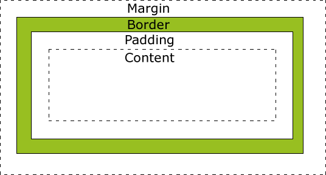
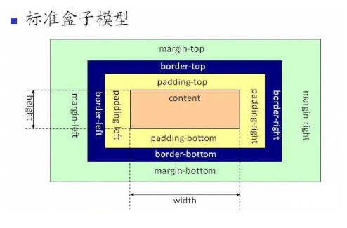
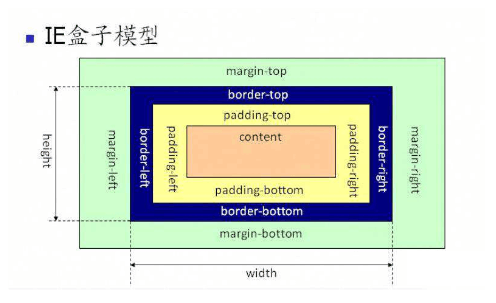
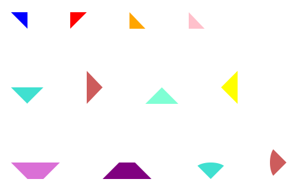

# CSS 第三天

## 复习

继承性

权值		!important > style > id > class > tag > *

权重		就近原则

元素样式
文字	color	#f00	rgb(r, g, b)	red

​	font-size	

​	font-weight	bold	

​	font-style

​	line-height

​	font-family

​	font	italic bold 20px/2 "黑体", "宋体"

文本样式

​	text-indent	em

​	text-align	justify

​	text-decoration

​	letter-spacing

​	word-spacing		hello ickt

​	white-space

​	text-overflow	ellipsis

​		截字：1 width， 2 overflow， 3 whie-space， 4 text-overflow

列表

​	list-style-type， list-style-image， list-style-position， list-style

## 一、盒模型

### 1.1 盒模型

盒子模型（Box Modle）可以用来对元素进行布局

​	盒子模型的组成：content内容（height\width）  padding内边距   border边框   margin外边距

盒子模型分类：标准的盒子模型与怪异（IE）盒模型(IE低版本浏览器下会自动呈现)

CSS3中定义盒子模型类型属性 box-sizing: content-box | border-box;

> ​	content-box 内容盒：设置的 width、height 属性为内容的宽高
>
> ​	border-box 边框盒：设置的 width、height 属性为边框以内相关盒子属性
>
> （border+padding+content） 的宽高



### 1.2 盒模型宽高

width 	设置盒子的宽度

height	设置盒子的高度

元素的宽高计算：

> ​	标准盒模型：元素的宽度和高度： content | width | height + border + padding + 
>
> margin（加值法）
>
> ​	怪异（IE）盒模型：元素的宽度和高度：width | height（content + border + padding） + 
>
> margin（减值法）





```html
<!DOCTYPE html>
<html lang="en">
<head>
    <meta charset="UTF-8">
    <meta name="viewport" content="width=device-width, initial-scale=1.0">
    <title>Document</title>
    <style>
        .box1,
        .box2,
        .box3 {
            width: 200px;
            height: 200px;
            padding: 25px;
            border: 10px solid green;
            margin: 200px;
            background: pink;
        }
        /* 标志的状态 */
        .box2 {
            box-sizing: content-box;
        }
        /* 怪异 */
        .box3 {
            box-sizing: border-box;
        }
    </style>
</head>
<body>
    <div class="box1">标准盒模型</div>
    <div class="box2">标准盒模型</div>
    <div class="box3">IE盒模型</div>
</body>
</html>
```


### 1.3 宽高应用

左右留白：网站左侧内边距是固定的，内容在右侧甩出的空白不一样，可以给定一个足够宽度，只设

置左边的内边距，右边空白区域自动剩余。

实际工作中，我们不设置高度。高度用内部的内容撑开。

​	是为了避免后期的问题。

​	新闻列表，可能会加载更多。为了让盒子自动撑高，不能设置高度。

​	注意：这只是一种应用情况，自动撑高盒子并不代表所有情况。

### 1.5 margin

同级元素之间的距离，或者距离父元素之间的距离；

margin设置分类：

1. ​	单值法  margin: 10px;   设置盒子的上下左右的外边距都为10个像素

2. ​	二值法  margin: 10px 20px;  设置盒子的上下的外边距为10个像素，左右外边距20像素

3. ​	三值法  margin: 10px 20px 30px;  设置盒子上外边距10个像素，左右外边距20像素，下外边距

    为30px

4. ​	四值法  margin: 10px 20px 30px 40px; 设置盒子从上边开始，顺时针分别设置个方向的外边距

按照方向划分：

- ​	margin-top   设置上外边距		
- ​	margin-right  设置右外边距
- ​	margin-bottom 设置下外边距	
- ​	margin-left  设置左外边距

```html
<!DOCTYPE html>
<html lang="en">
<head>
    <meta charset="UTF-8">
    <meta name="viewport" content="width=device-width, initial-scale=1.0">
    <title>Document</title>
    <style>
        .container {
            border: 1px solid red;
            width: 800px;
            height: 800px;
        }
        .box1,
        .box2 {
            width: 100px;
            height: 100px;
            background: green;
        }
        /* 设置盒子外边距 */
        .box1 {
            /* 单值法 */
            /* margin: 50px; */
            /* 二值法: 上下， 左右 */
            /* margin: 50px 100px; */
            /* 三值法: 上， 左右， 下 */
            /* margin: 50px 100px 150px; */
            /* 四值法 */
            /* margin: 50px 100px 150px 200px; */
            /* 单独设置，等价形式 */
            margin-top: 50px;
            margin-right: 100px;
            margin-bottom: 150px;
            margin-left: 200px;
        }
    </style>
</head>
<body>
    <div class="container">
        <div class="box1">box1</div>
        <div class="box2">box2</div>
    </div>
</body>
</html>
```


### 1.6 margin 塌陷

同级元素分别设置了上下外边距，两个盒子之间的上下外边距会产生合并（塌陷），之间的距离以设

置的margin-bottom（上面盒子）或margin-top（下面盒子）的值中较大的那个为准。

存在嵌套关系的元素，父盒子在不设置padding、border、overflow等属性的情况下，会出现外边距

合并（塌陷）问题，嵌套关系的元素如果同时设置了上下外边距以最大的那个为准

```html
<!DOCTYPE html>
<html lang="en">
<head>
    <meta charset="UTF-8">
    <meta name="viewport" content="width=device-width, initial-scale=1.0">
    <title>Document</title>
    <style>
        .container {
            border: 1px solid blue;
            width: 800px;
            height: 800px;
        }
        .box1,
        .box2 {
            width: 100px;
            height: 100px;
            /* 背景 */
            background: pink;
        }
        /* 为box1设置下外边距，为box2设置上外边距 */
        .box1 {
            /* margin-bottom: 50px; */
            /* margin-bottom: 100px; */
            /* 200大于100，所以保留200 */
            margin-bottom: 200px;
        }
        .box2 {
            margin-top: 100px;
        }
        /* 父子元素之间的margin塌陷 */
        .demo1 {
            height: 800px;
            background-color: yellowgreen;
            margin-top: 150px;
            /* 阻止传递 */
            overflow: hidden;
        }
        .demo2 {
            height: 500px;
            margin-left: 100px;
            background-color: skyblue;
            /* 子元素设置上边距, 上边距传递到父元素上去了 */
            margin-top: 100px;
            /* 不想让demo3向上传递 */
            /* 1 设置padding */
            /* padding: 1px; */
            /* padding: 0.1px; */
            /* padding的值必须大于0，保险起见：值要大于等于1 */
            /* padding: 0; */
            /* 2 设置border */
            /* border: 1px solid red; */
            /* overflow: hidden; */
        }
        /* 后代元素 */
        .demo3 {
            height: 50px;
            background: gold;
            margin-left: 100px;
            /* 后代元素设置上边距 */
            /* margin-top: 50px; */
            margin-top: 300px;
        }
        /* 总结 */
        /* 1 子元素设置了上边距，默认传递给父元素 */
        /* 2 父元素设置了上边距，会与子元素合并 */
            /* 合并的时候，以大的为准 */
        /* 3 后代元素设置的上边距会一直传递到body */
        /* 4 父元素的上边距会与后代元素上边距合并，保留大的 */
        /* 5 可以通过padding, overflow, border来阻止margin-top的传递，必须显性设置 */
        /* 6 兄弟元素之间上下外边距会合并，保留大的 */
        /* 7 左右边距不会合并 */

        /* 左右边距 */
        .ickt {
            width: 1200px;
            height: 800px;
        }
        .img1 {
            margin-right: 50px;
        }
        .img2 {
            margin-left: 100px;
        }
        .ickt span {
            background: red;
            margin: 20px;
        }
        /* .ickt {
            font-size: 0;
        }
        .ickt img {
            display: block;
        } */
    </style>
</head>
<body>
    <!-- 左右边距 -->
    <div class="ickt">
        <span>1</span>
        <span>2</span>
        
        
    </div>
    <!-- 父子与后代元素之间的塌陷 -->
    <div class="demo1">
        <div class="demo2">
            <!-- 后代元素 -->
            <div class="demo3"></div>
        </div>
    </div>
    <!-- 左右 -->
    <!-- 兄弟元素之间的塌陷 -->
    <div class="container">
        <!-- 同一个父元素中的两个子元素互为兄弟元素。 -->
        <div class="box1">box1</div>
        <div class="box2">box2</div>
    </div>
</body>
</html>
```


### 1.7 border

用来设置盒子的边框

第一种：根据方向设置：

- ​	border-top 	设置上边框		
- ​	border-bottom	设置下边框
- ​	border-left	设置左边框		
- ​	border-right 	设置右边框	

第二种：按照属性类型：

- ​	border-style  设置边框的线型  solid实线   dashed虚线  dotted点线  double双实线
- ​	border-width  设置边框的厚度  像素值  thick粗线  thin细线  medium中等线宽
- ​	border-color  设置边框的颜色

第三种：简写方式同时设置四个方向为相同的值

- ​	border: style width color;

```html
<!DOCTYPE html>
<html lang="en">
<head>
    <meta charset="UTF-8">
    <meta name="viewport" content="width=device-width, initial-scale=1.0">
    <title></title>
    <style>
        .box {
            width: 200px;
            height: 200px;
            margin: 100px;
            background: green;
            /* 统一设置 */
            /* bd+ + tab */
            border: 10px solid red;
            /* 单独设置每一个样式 */
            /* 样式 */
            border-style: dashed;
            /* 粗细 */
            border-width: thick;
            /* 颜色 */
            border-color: gold;
            /* 单独设置某个一方向 */
            /* 上下左右 */
            border-top: 50px solid red;
            border-bottom: 20px dashed orange;
            border-left: 30px dotted skyblue;
            border-right: 60px double purple;

            /* 分别对上下左右四条边，设置不同的属性 */
            border-top-color: pink;
            border-top-width: 40px;
            border-top-style: groove;
            /* border-top-color,    border-top-width,       border-top-style */
            /* border-bottom-color, border-bottom-width,    border-bottom-style */
            /* border-left-color,   border-left-width,      border-left-style */
            /* border-right-color,  border-right-width,     border-right-style */


            /* 注意：背景色设置到边框 */
        }
    </style>
</head>
<body>
    <div class="box"></div>
</body>
</html>
```


### 1.8 绘制三角形

通过 CSS 实现下列图形：



```html

### 1.9 padding

内容距离边框之间的填充部分（内边距）

padding设置分类：

1. ​	单值法  padding:10px;   设置盒子的上下左右的内边距都为10个像素

2. ​	二值法  padding:10px 20px;  设置盒子的上下的内边距为10个像素，左右内边距20像素

3. ​	三值法  padding:10px 20px 30px;  设置盒子上内边距10个像素，左右内边距20像素，下内边

    距为30px

4. ​	四值法  padding:10px 20px 30px 40px; 设置盒子从上边开始，顺时针分别设置个方向的内边

    距

按照方向划分：

- ​	padding-top   设置上内边距	
- ​	padding-right  设置右内边距
- ​	padding-bottom 设置下内边距	
- ​	padding-left  设置左内边距

### 1.10 百分比设置

当margin和padding使用百分比表示时，

​	不管是哪个方向都是参照父元素的宽度设置的。

```html
<!DOCTYPE html>
<html lang="en">
<head>
    <meta charset="UTF-8">
    <meta name="viewport" content="width=device-width, initial-scale=1.0">
    <title></title>
    <style>
        .container {
            width: 800px;
            height: 800px;
            border: 5px solid orange;
        }
        .box {
            width: 100px;
            height: 100px;
            background: green;
            margin: 100px;
            /* 内边距 */
            /* 单值法 */
            /* padding: 100px; */
            /* 二值法 */
            /* padding: 100px 50px; */
            /* 三值法 */
            /* padding: 100px 50px 20px; */
            /* 四值法 */
            /* padding: 50px 70px 90px 30px; */
            /* 等价写法 */
            padding-top: 50px;
            padding-right: 70px;
            padding-bottom: 90px;
            padding-left: 30px;
        }
        /* 百分比设置 */
        .ickt {
            width: 1000px;
            height: 500px;
            border: 10px solid pink;
            padding: 100px;
        }
        .demo {
            width: 100px;
            height: 100px;
            background: green;
            /* 二值法 */
            margin: 10% 20%;
            padding: 10% 20%;
            /* 使用百分比的时候，相对于父元素的宽度。 */
        }
    </style>
</head>
<body>
    <!-- 百分比设置 -->
    <div class="ickt">
        <div class="demo"></div>
    </div>
    <!-- 内边距 -->
    <div class="container">
        <div class="box"></div>
    </div>
</body>
</html>
```


## 二、标准文档流

### 2.1 标志文档流

类似我们的Word文档，书写内容的时候必须在光标位置书写。光标位置受前面元素的影响。前面字

号变大了、图片变大了，光标会往下移动。

Word是标准文档流：书写时必须从上到下、从左到右书写。

网页制作的时候：web制作也是标准文档流，必须从上往下制作。

### 2.2 标准文档流特征

- 文本类的内容有空白折叠现象。
- 文本类的内容：高矮不齐，底边对齐（baseline基线）。
- 文本类的内容如果超过了盒子宽度会自动换行。

### 2.3 标签分类

标准文档流将所有的标签区分成两种：块级和行内级。

- ​	块级：所有的容器级标签都是块级元素。p标签也是块级元素。
- ​	行内级：除了p之外的所有文本级的标签都是行内元素。

html 中标签分类：容器级和文本级

标准文档流中标签分类：块级和行内级

​	容器级 => 块级， 文本级 => 行内级

​	但 p 标签要特殊记。

### 2.4 块级元素

块级元素的性质：

​	可以设置宽高，具有换行符；

​	容器默认独立占有一行；

​		如果设置了宽高，那么容器范围为设置宽高的大小（但是还是具有换行效果）

​		如果没设置宽度，会自动撑满父亲。父级的100%

​	如果非块级元素，想要设置为块级元素 display: block;

​	目前为止学过的块级元素：div  h1-h6  p等

```html
<!DOCTYPE html>
<html lang="en">
<head>
    <meta charset="UTF-8">
    <meta name="viewport" content="width=device-width, initial-scale=1.0">
    <title></title>
    <style>
        span {
            font-size: 100px;
        }
        h1 {
            width: 600px;
        }
        /* 块级元素 */
        .container {
            width: 1000px;
            height: 800px;
            background: pink;
        }
        .box1 {
            height: 100px;
            width: 200px;
            background: green;
        }
        .box2 {
            height: 100px;
            background: orange;;
        }
        .box3 {
            /* 行内元素转成块元素 */
            display: block;
            background: gold;
        }
    </style>
</head>
<body>
    <h1>hello ggg               <span>ickt yyy yyy</span>!</h1>
    <!-- 块级元素 -->
    <div class="container">
        <div class="box1">box1</div>
        <span class="box3">hello1</span>
        <span>hello2</span>
        <div class="box2"></div>
    </div>
</body>
</html>
```


### 2.5 行内元素

行内元素的性质：	不可以设置宽高，与其它行内级元素，在同一行内，从左到右依次排列；

​	容器默认包裹内容，宽度由内容撑开。

​	行内元素设置的margin、padding上下不生效（不占位置，但是背景色能呈现），左右生效

​	如果非行内元素，想要设置为行内元素 display:inline;

​	目前学过的行内元素：span   a  strong  label等

```html
<!DOCTYPE html>
<html lang="en">
<head>
    <meta charset="UTF-8">
    <meta name="viewport" content="width=device-width, initial-scale=1.0">
    <title>Document</title>
    <style>
        .container {
            width: 800px;
            height: 800px;
            background: pink;
        }
        .text1 {
            background: gold;
            /* 不生效 */
            width: 100px;
            height: 100px;
            margin: 50px;
            padding: 50px;

        }
        .text2 {
            background: green;
            margin: 50px;
            padding: 50px;
        }
        .text3 {
            background: skyblue;
        }
        .box {
            height: 100px;
            background: yellowgreen;
            margin-left: 100px;
            /* 转成行内元素 */
            display: inline;
        }
    </style>
</head>
<body>
    <div class="container">
        <span class="text1">text 1-1-1</span><span class="text2">text 2-2-2</span><span class="text3">text 3-3-3</span>
        <div class="box">box</div>
    </div>
</body>
</html>
```


### 2.6 行内快元素

行内块性质：

​	可以设置宽高，与其它行内级元素在同一行内从左到右依次排列；

​	容器默认包裹内容；如果设置了宽高，那么容器的范围，就是设置宽高的大小

​	此时上下padding和上下margin会挤占空间。

​	如果非行内块元素，想要设置为行内元素 display:inline-block;

​	目前学过的行内块元素：img  textarea  input等

块级元素和行内元素可以互相转换，css有一个属性叫做显示模式（display）.

​	两个属性值：block（块级）、inline（行内）、inline-block（行内块）。

​	行内转块：（常用）

```html
<!DOCTYPE html>
<html lang="en">
<head>
    <meta charset="UTF-8">
    <meta name="viewport" content="width=device-width, initial-scale=1.0">
    <title>Document</title>
    <style>
        .container {
            width: 1600px;
            height: 800px;
            background: pink;
        }
        img {
            width: 100px;
        }
        textarea {
            width: 300px;
        }
        span {
            /* 转成行内快 */
            display: inline-block;
            width: 600px;
            height: 50px;
            background: green;
            padding: 100px;
            font-size: 100px;
        }
        div {
            /* 行内快 */
            /* display: inline-block; */
            background: gold;
            /* width: 100px; */
            height: 100px;
        }
    </style>
</head>
<body>
    <div class="container">
        
        <textarea name="" id="" cols="30" rows="10"></textarea>
        <input type="text">
        <span>hello ggg</span>
        <div>box</div>
    </div>
</body>
</html>
```

