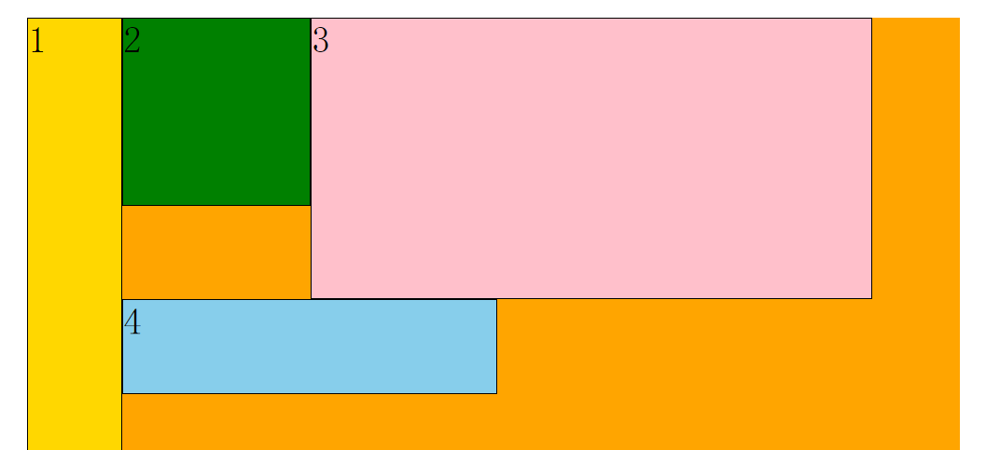
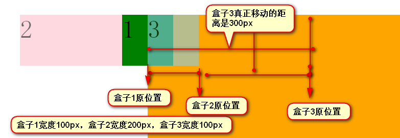

# CSS 第五天

复习

隐藏元素：display: none;  visibility: hidden; opacity; 0;

居中：

​	单行文本

​	多行文本

​	元素：块， 行内元素， 行内块

浮动：脱离标准文档流的体现（脱标）

特征： 1 2 3 4 5 6

清除浮动：1 height， 2 外墙法，3 内墙法

## 一、浮动

### 1.1 浮动塌陷问题

上面提到，在父元素不设置宽高的情况下，嵌套的子元素如果都设置了浮动，会呈现出父元素塌陷的

效果。

这个问题，需要解决，否则有可能会影响页面的布局。解决方案：

1. ​	给父元素设置高度：这种方式在确定宽高的情况下，可以使用；但很多时候，容器都是由内容

    撑起来，所以根据内容的多少，不太好控制这个高度（改动较大）

2. 外墙法：在父元素的后面，设置父元素的一个同级空元素（div），设置清除浮动；这种方式需要

    添加	过多的空元素，增加结构代码量；并且我们完全可以在后面那个同级父元素上直接清除浮

    动。

3. 内墙法：在父元素内部后面，添加一个空的子元素（div），设置清除浮动；问题同外墙法类似，

    但是	解决了外墙法不能解决的父元素塌陷问题；相对于给父元素设置高度的不确定性，这种方

    式直接内容撑起父元素的高度。

4. 父元素设置为浮动，后面元素清除浮动：会触发更多的问题

5. 父元素设置位行内块元素：display:inline-block;  达不到想要的布局效果

6. 父元素设置overflow属性：overflow属性本身是用来解决内容溢出元素的，处理方式：

    ​	hidden代表溢出隐藏  

    ​	auto溢出自适应（内容没有溢出时无滚动条，溢出后有滚动条）

    ​	scroll内容不管是否溢出，都会出现滚动条 

    ​	默认的visible溢出可视，不能解决父元素塌陷问题。这种方式，在需要内容溢出盒子显示时，

    可能会影响内容的显示效果

7. 通过伪元素清除浮动：将伪元素插入到容器元素的最后面，代替内墙法中插入的元素，并用伪元

    素

8. 使用 clearfix 类清除浮动：工作中，我们常常将清除浮动的功能封装在一个clearfix类中，这样为

    容器元素设置该类，就可以清除浮动，这种方式可以复用，因此工作中很常用。

```html
.list1 {
    background: green;
    width: 800px;
    /* 父容器浮动 */
    float: left;
}
.box4 {
    /* 清除浮动 */
    clear: both;
    height: 50px;
    background: pink;
}

.list1 {
    background: green;
    width: 800px;
    /* 设置为行内块 */
    display: inline-block;
}

.list1 {
    background: green;
    width: 800px;
    /* 内容溢出处理方式 */
    /* 溢出隐藏 */
    /* overflow: hidden; */
    /* 有溢出出现滚动条 */
    /* overflow: auto; */
    /* 显示滚动条 */
    /* overflow: scroll; */
    /* 溢出显示，不能清除浮动 */
    overflow: visible;
}

/* 通过为元素来清除浮动 */
.list1:after {
    /* 设置伪元素内容为空 */
    content: "";
    /* 清除浮动 */
    clear: both;
    /* 设置为块元素 */
    display: block;
}

/* 创建clearfix类，来复用 */
.clearfix:after {
    /* 内容 */
    content: "";
    /* 块元素 */
    display: block;
    /* 清除浮动 */
    clear: both;
}
```


### 1.2 伪元素

伪元素用于创建一些不在文档树中的元素，并为其添加样式。比如说，我们可以通过:before来在一个

元素前增加一些文本，并为这些文本添加样式。虽然用户可以看到这些文本，但是这些文本实际上不

在文档树中。CSS2.1中提供了两个伪元素

- ​	:before		在元素前面插入文本
- ​	:after		在元素后面插入文本

​	注意：伪元素必须设置content样式，否则伪元素不会生效

```html
<!DOCTYPE html>
<html lang="en">
<head>
    <meta charset="UTF-8">
    <meta name="viewport" content="width=device-width, initial-scale=1.0">
    <title>Document</title>
    <style>
        /* 伪元素 */
        h1:before {
            /* 必须设置content属性 */
            content: "before content";
            color: red;
            font-size: 50px;
            display: block;
        }
        /* 后面插入伪元素 */
        h1:after {
            content: "after content";
            color: green;
        }
    </style>
</head>
<body>
    <h1 class="box">hello</h1>
</body>
</html>
```


### 1.3 伪类

伪类用于当已有元素处于的某个状态时，为其添加对应的样式，这个状态是根据用户行为而动态变化

的。比如说，当用户悬停在指定的元素时，我们可以通过:hover来描述这个元素的状态。虽然它和普

通的css类相似，可以为已有的元素添加样式，但是它只有处于dom树无法描述的状态下才能为元素

添加样式，所以将其称为伪类。

​	如：:focus{ 样式: 样式值; }  获取焦点；表单控件中使用

### 1.4 伪元素与伪类

伪元素与伪类的特点：

- ​	伪元素和伪类都不会出现在源文档或者文档树中
- ​	伪类允许出现在选择器的任何位置，而一个伪元素只能跟在选择器的最后一个简单选择器后面
- ​	伪元素名和伪类名都是大小写不敏感的，建议小写。
- ​	有些伪类是互斥的，而其它的可以同时用在一个元素上。

伪元素和伪类的区别：

- ​	伪类的操作对象是文档树中已有的元素，而伪元素则创建了一个文档数外的元素。
- ​	伪类是类，伪元素是元素，因此它们的权值是不同的。

### 1.5 a 标签的伪类

a 标签可以定义四个伪类：

​	:link { 样式: 样式值; }    初始状态；必须是第一次访问或者清除历史记录的访问

​	:visited { 样式: 样式值; }  访问后的状态

​	:hover { 样式: 样式值; }   鼠标悬停；鼠标滑过效果

​	:active { 样式: 样式值; }   激活状态

​	上面四个的使用顺序  l-v-h-a(love hate 爱恨准则)

```jtml
<!DOCTYPE html>
<html lang="en">
<head>
    <meta charset="UTF-8">
    <meta name="viewport" content="width=device-width, initial-scale=1.0">
    <title>Document</title>
    <style>
        /* .inp {
            color: red;
        } */
        /* 伪类 */
        /* .inp:focus {
            color: red;
        } */
        /* 伪元素 */
        /* .demo:before {
            content: "before input";
        } */
        .container {
            height: 300px;
            width: 300px;
            background: green;
        }
        /* 鼠标滑过container，让input文本变成红色 */
        /* .container:hover input {
            color: red;
        } */
        .container:HOVER input {
            color: red;
        }
        /* 设置伪元素的语法不合法，伪元素只能添加在最后一个简单的选择器上 */
        /* .container:before .demo { */
        /* .container .demo:before {
            content: "before div";
            font-size: 50px;
        } */
        .container .demo:BEFORE {
            content: "before div";
            font-size: 50px;
        }
        /* love hate： link, visited, hover, active */
        /* 链接样式 */
        /* a:link {
            color: red;
        }
        a:visited {
            color: green;
        }
        a:hover {
            color: orange;
        }
        a:active {
            color: skyblue;
        } */
    </style>
</head>
<body>
    <div class="container">
        <input class="inp" type="text" value="hello">
        <div class="demo"></div>
    </div>
    <a href="#/demo33"> link-1 </a> <br>
    <a href="#/demo333"> link-2 </a> <br>
    <a href="#/demo3333"> link-3 </a> <br>
    <a href="#/demo33333"> link-4 </a> <br>
    <a href="#/demo333333"> link-5 </a> <br>
</body>
</html>
```


### 1.6 浮动元素依次贴边

默认盒子会按照序列排序，如果盒子前面有兄弟元素，盒子将紧贴它的兄弟元素；如果没有。盒子将

帖边（帖在父元素的边上）

也就是说，如果一行容不下该元素，该元素会自动进入下一行，找到能够容下它的位置，然后渲染

例如老四，直接贴在老二上了

如果继续往下找，发现下一行能够容下它，它会渲染，即使上边有多余的空隙（能够容下它），他也

不会钻进去，所以说他受他前面一个元素的影响





```html
<!DOCTYPE html>
<html lang="en">
<head>
    <meta charset="UTF-8">
    <meta name="viewport" content="width=device-width, initial-scale=1.0">
    <title></title>
    <style>
        .container {
            width: 800px;
            height: 800px;
            background: orange;
            margin: 20px auto;
        }
        .container div {
            /* 可以贴到浮动元素上显示 */
            /* float: left; */
            /* 另起一行显示 */
            display: inline-block;
            font-size: 50px;
        }
        .box1 {
            width: 100px;
            height: 600px;
            background: gold;
        }
        .box2 {
            /* width: 200px; */
            /* 增加老二宽度 */
            width: 400px;
            /* height: 500px; */
            /* 降低2的高度 */
            height: 200px;
            background: green;
        }
        .box3 {
            /* width: 400px; */
            /* 减少老三宽度 */
            width: 200px;
            height: 300px;
            background: pink;
        }
        .box4 {
            width: 300px;
            height: 100px;
            background: skyblue;
        }
    </style>
</head>
<body>
    <div class="container">
        <div class="box1">1</div>
        <div class="box2">2</div>
        <div class="box3">3</div>
        <div class="box4">4</div>
    </div>
</body>
</html>
```


### 1.7 浮动与行内块元素

浮动：

​	使元素脱离文档流，按照指定的方向发生移动，遇到父级的边界或者相邻的浮动元素就会停下来

行内块：

​	它具有行内元素和块元素两者的特点，可以实现对元素的有序排序。

两者的区别

1. ​	两者主要区别在于当标签的高度不一致时，体现出的差异，如果高度不一致时候，

    浮动的元素会改变排列的顺序（贴边）		

    行内块元素会按顺序排列，行内块元素不会贴边，会另起一行

2. ​	浮动元素脱离文档流，不会抢占空间，而行内块元素会抢占空间。

### 1.8 margin对元素宽度的影响

如果块元素没有设置宽度，默认宽度就是父容器的宽度

如果我们修改margin，盒子的宽度会变化么？

​	在没有设置盒子宽度的情况下，修改margin会影响盒子的宽度

- ​		margin-left或者margin-right设置正值，盒子宽度减小
- ​		margin-left或者margin-right设置负值，盒子宽度增加

​	如果盒子设置了宽度，不论如何更改margin-left或者margin-right，盒子的宽度都不会改变，但是

位置变化了，并且marign-left改变位置的优先级要高于marign-right改变位置的优先级（可以通过父

容器的html属性align来更改优先级。）

```html
<!DOCTYPE html>
<html lang="en">
<head>
    <meta charset="UTF-8">
    <meta name="viewport" content="width=device-width, initial-scale=1.0">
    <title></title>
    <style>
        .parent {
            width: 800px;
            height: 800px;
            margin: 0 auto;
            background: pink;
        }
        .child {
            height: 400px;
            background: green;
            /* margin-left和margin-right是正直，盒子宽度减小 */
            /* margin-left: 100px;
            margin-right: 200px; */
            /* margin-left和margin-right是正直，盒子宽度增加 */
            /* margin-left: -100px;
            margin-right: -200px; */
            /* 设置了宽度，margin无法改变宽度 */
            width: 500px;
            /* 左边距 */
            /* margin-left: 200px; */
            margin-left: -200px;
            /* 右边距 */
            margin-right: 200px;
        }
    </style>
</head>
<body>
    <!-- 可以通过align属性更改盒子的对齐方式 -->
    <div class="parent" align="right">
        <div class="child"></div>
    </div>
</body>
</html>
```


### 1.9 margin对浮动元素的影响

对于标准文档流来说，块元素占满整行，因此设置他的水平方向的margin，不会影响后面的元素

marign是相对于原有位置移动的

如果让盒子浮动，此时对盒子设置边距会影响后面的元素，前面元素位置不受影响（浮动元素贴边的

特性）

1. 如果浮动的盒子通过margin移动，是受前面元素影响的，那么盒子移动的距离就是前面所有盒

    子移动的距离

2. 如果将盒子2移动到盒子1前面，移动的距离与盒子1移动的距离无关，与盒子1以及盒子2的宽

3. 度有关：盒子1的宽度 + 盒子2的宽度 = 200px + 200px = 400px

4. 当盒子2移动到盒子1前面，盒子3盒子1贴边了（盒子3没有设置边距，与1贴边）

    为盒子设置边距（-50px）时，这时移动的真实距离是：盒子1移动的距离，+盒子2 的宽度+盒子3

    移动的距离：50px + 200px + 50px = 300px。盒子3跨过盒子2（与盒子2宽度有关），与盒子1贴

    边（与盒子1移动的距离有关），自身又移动了（与盒子3自身移动的距离有关）

    ```hml
    <!DOCTYPE html>
    <html lang="en">
    <head>
        <meta charset="UTF-8">
        <meta name="viewport" content="width=device-width, initial-scale=1.0">
        <title>Document</title>
        <style>
            .container {
                width: 800px;
                height: 800px;
                background: gold;
                margin: 0 auto;
            }
            .container div {
                width: 100px;
                height: 100px;
                font-size: 50px;
                color: red;
                /* 浮动 */
                float: left;
            }
            .box1 {
                background: green;
                margin-left: -50px;
            }
            .box2 {
                background: pink;
                /* 水平方向设置边距 */
                margin-left: -50px;
                opacity: 0.7;
            }
            .box3 {
                background: skyblue;
                opacity: 0.7;
                margin-left: -50px;
            }
            /* 重写参考位置的容器 */
            .ickt {
                height: 100px;
                background: rgb(180, 119, 162);
            }
            .ickt div {
                margin-left: 0;
            }
            /* 结论1 */
            /* 浮动元素移动的距离受前面元素影响，移动的距离就是前面元素移动距离之和 */
            /* box3移动的距离 = box1移动的距离 + box2移动的距离 + 自身移动的距离 = 50 + 50 + 50 = 150 */
            /* w代表自身宽度，d代表移动距离 */
            /* 依次贴边： d3 = d1 + d2 + d3 */
            
            /* 结论2 */
            /* 让盒子2移动到盒子1的前面，盒子2移动的距离与盒子1无关，与盒子2与盒子1的宽度有关 */
            /* 移动的距离：盒子2的宽度 + 盒子1的宽度 */
            /* w代表自身宽度，d代表移动距离 */
            /* 2贴1边： d2 = w1 + w2 */
            
            /* 结论3 */
            /* 如何盒子2移动到盒子1的前面，此时盒子3移动的距离是：盒子1移动的距离 + 盒子2的宽度 + 盒子3移动的距离 */
            /* w代表自身宽度，d代表移动距离 */
            /* 2移出去，3贴1边： d3 = d1 + w2 + d3 */
            
            /* 结论4 */
            /* 如果盒子1移动的距离超出了盒子1的宽度，此时盒子2移动（盒子1宽度+盒子2宽度）的时候，就不能保证始终在盒子1前面，因此此时盒子2在移动之前没有与盒子1贴边 */
            /* 2贴容器，所以1与2无关了，都是相对于容器的边来移动，可能会遮盖 */
        </style>
    </head>
    <body>
        <!-- 参考容器 -->
        <div class="container ickt">
            <div class="box1">1</div>
            <div class="box2">2</div>
            <div class="box3">3</div>
        </div>
        <div class="container">
            <div class="box1">1</div>
            <div class="box2">2</div>
            <div class="box3">3</div>
        </div>
    </body>
    </html>
    ```

    

  

