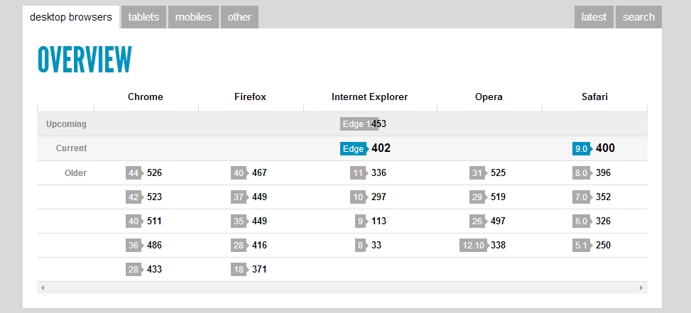
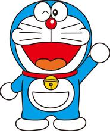

# CSS 第七天

## 复习

background-color

background-image

background-repeat

background-position	数值， 变量， 百分比

​		background-position-x, 		background-position-y

background-attachment	fixed， scroll

background: color, image, repeat, position, attachment;

精灵图：定点， 水平，垂直

列表布局： w = iw * n + (n - 1) * m

​	容器元素设置负margin

image： 居中并裁剪

## 一、定位

### 1.1 定位

脱离文档流常用的有三种方式：浮动，绝对定位，固定定位

定位就是确定有一个元素的位置，确定元素是基于什么样的方式进行渲染的

可以通过position属性设置

> ​		relative：相对定位
>
> ​		absolute：绝对定位
>
> ​		fixed：固定定位
>
> ​		static：静态定位（渲染在文档流中，默认值）

### 1.2 相对定位

相对定位就是相对于元素原有位置的定位，

注意

- 这种定位的元素并没有脱离文档流，因此对于它的位置设定不会影响其它兄弟元素
- 相当于占了一个坑，但是人不在这里
- 一旦元素设置position（除了static其余三个值均可）会激活四个属性；top，left，right，bottom
- 这四个属性可以定义位置的偏移量

​	相当于占了一个坑，但是人不在这里

​	一旦元素设置position（除了static其余三个值均可）会激活四个属性；top，left，right，bottom

​	这四个属性可以定义位置的偏移量

注意：这里的正负值表示

- 正值：向中心方向偏移要设置正值
- 负值：向边缘方向偏移要设置负值

注意：在标准的 css 坐标系中，

- 水平方向：向右为正，向左为负，		
- 垂直方向：向下为正，向上为负

**优先级**：

​	left和right都能改变水平方向的偏移量，但是left的优先级要高于right

​	top和bottom都能改变垂直方向的偏移量，但是top的优先级要高于bottom

​	所以工作中，要尽量设置 top 和 left

**应用**

- ​	由于相对定位，使元素并未脱离文档流，

- ​	因此对这类元素边距的设置，会影响兄弟元素，

- ​	但是对这类元素的偏移量的设置，不会影响他的兄弟元素（因为偏移量的设置不会改变容器的尺寸）

    ​		如：更改文字渲染位置，更改图标位置

- ​	有时候还会用相对定位来辅助绝对定位。

```html
<!DOCTYPE html>
<html lang="en">
<head>
    <meta charset="UTF-8">
    <meta name="viewport" content="width=device-width, initial-scale=1.0">
    <title>Document</title>
    <style>
        /* 设置样式 */
        div {
            width: 100px;
            height: 100px;
            background-color: pink;
            font-size: 50px;
            color: green;
            border: 1px solid #000;
        }
        .box2 {
            /* 浮动后，兄弟元素受到影响，脱离文档流，后面元素挤上来了 */
            /* float: left; */
            /* margin-left: 200px; */
            /* 不希望影响兄弟元素的位置 */
            position: relative;
            /* 设置偏移量 */
            /* 相对于原来的位置 */
            top: 100px;
            left: 200px;
            /* left和top优先级要高于bottom和right */
            bottom: 100px;
            right: -100px;
            /* auto表示自适应，是默认值 */
            /* top,left,right,bottom无法改变元素宽高 */
            /* width: auto;
            height: auto; */
        }
        span {
            padding: 12px;
            background: url(./images/1.png) no-repeat;
            font-size: 0;
            /* 设置margin影响了文字的位置 */
            /* margin-top: 20px;
            display: inline-block; */
            /* 我们可以使用相对定位来解决 */
            position: relative;
            top: -7px;
        }
        strong {
            font-size: 14px;
            font-weight: normal;
            /* 在文件的右上角显示 */
            position: relative;
            top: -20px;
            left: 10px;
            /* 设置margin可以影响兄弟元素 */
            margin-right: 15px;
        }
    </style>
</head>
<body>
    <div class="box1">1</div>
    <div class="box2">2</div>
    <div class="box3">3</div>
    <div class="box4">4</div>
    <!-- 设置列表 -->
    <ul>
        <li><span></span>标题</li>
    </ul>
    <h1>爱创<strong>100</strong>课堂</h1>
</body>
</html>
```


### 1.3 绝对定位

设置position属性的时候，如果设置的属性值是absolute，此时就是绝对定位

​	注：绝对定位跟相对定位不同，影响后面的兄弟元素

**默认相对 body 定位**：

- ​	在相对定位中，相对于原有位置进行定位的
- ​	在绝对定位中，相对于body元素定位的

注意

- ​	设置top的时候，根据body的顶边定位
- ​	设置bottom的时候，相对于屏幕的底边定位
- ​	left和right是相对于body左右边定位的。

绝对定位影响宽高：在未设置盒子的宽度和高度的时候，我们可以通过绝对定位的偏移量：top，

bottom，right, left来设置盒子的宽高，然而相对定位不可以

```html
<!DOCTYPE html>
<html lang="en">
<head>
    <meta charset="UTF-8">
    <meta name="viewport" content="width=device-width, initial-scale=1.0">
    <title>Document</title>
    <style>
        body {
            /* padding: 100px; */
        }
        .box {
            width: 100px;
            height: 100px;
            background-color: pink;
            border: 1px solid green;
            font-size: 50px;
            color: red;
        }
        .box2 {
            /* 绝对定位。脱离文档流 */
            position: absolute;
            /* 默认相对于body左上角，不是body内容部分 */
            top: 300px;
            left: 200px;
            right: 200px;
            /* 相对于屏幕底部 */
            bottom: 200px;
            /* 如果不设置宽高，此时top,bottom,left,right可以更改元素的宽高 */
            /* auto表示自适应，是默认值 */
            width: auto;
            height: auto;
        }
    </style>
</head>
<body>
    <div class="box box1">1</div>
    <div class="box box2">2</div>
    <div class="box box3">3</div>
    <div class="box box4">4</div>
    <div class="box box5">5</div>
</body>
</html>
```


**就近原则**

嵌套的盒子设置了绝对定位，它会寻找离他最近的设置了定位的祖先元素（绝对定位，相对定位，固

定定位），以此来确定定位的偏移量。	也就是说，此时不再以body定位，而是相对设置了定位的祖

先元素定位

**定位顶点**：绝对定位是相对于父元素的padding定点（包含padding）进行定位设置的。设置border

会影响定位的结果

display：不论是行内元素，还是块元素，设置了绝对定位，display属性失效，此时有点类似inline-

block，不论是块元素还是行内元素，都可以直接设置宽高

**压盖现象**：元素设置了绝对定位，此时会有压盖现象，后面的元素会显示在前面的元素上面

绝对定位居中

​	我们可以根据绝对定位的特性让元素居中

​	绝对定位是相对于元素左上角的一点进行定位的，我们可以将其设置成50%,此时该元素的左上角一

点将在页面中心，我们通过margin向上和向左平移宽高的一半，既可以实现元素的居中（兼容块元素

和行内元素，绝对定位不会区分块元素和行内元素）

```html
<!DOCTYPE html>
<html lang="en">
<head>
    <meta charset="UTF-8">
    <meta name="viewport" content="width=device-width, initial-scale=1.0">
    <title>Document</title>
    <style>
        .container {
            margin: 100px;
            padding: 100px;
            width: 400px;
            height: 400px;
            background-color: pink;
            /* border: 50px solid #ccc; */
            border: 100px solid #ccc;
            /* 父元素设置定位，工作中，relative常用：1 不会脱离文档流， 2 不会影响后面的元素 */
            position: relative;
            /* position: absolute; */
        }
        .box {
            width: 100px;
            height: 100px;
            background-color: green;
            /* 绝对定位 */
            position: absolute;
            /* 默认相对于body定位 */
            /* 相对于离它最近的设置了定位的元素 */
            top: 100px;
            left: 100px;
        }
        /* 中间插入了元素 */
        .inner {
            width: 200px;
            height: 200px;
            background-color: gold;
            /* position: relative; */
        }
        /* 行内元素设置绝对定位 */
        .box2 {
            width: 100px;
            height: 100px;
            /* 设置了定位，display属性失效了 */
            /* display: block; */
            background: greenyellow;
            position: absolute;
            top: 150px;
            left: 150px;
            /* 定位居中 */
            top: 50%;
            left: 50%;
            /* margin-top: -50px;
            margin-left: -50px; */
            /* 通过margin复合属性设置 */
            margin: -50px -50px;
        }
        .box3 {
            width: 500px;
            height: 400px;
            background-color: skyblue;
            /* 居中 */
            position: absolute;
            top: 50%;
            left: 50%;
            /* 通过margin移动盒子: 负宽高的一半 */
            /* 默认相对于body，在屏幕中间 */
            margin-top: -200px;
            margin-left: -250px;
        }
    </style>
</head>
<body>
    <div class="container">
        <div class="inner">
            <div class="box"></div>
            <span class="box2">span</span>
        </div>
    </div>
    <h1>hello</h1>
    <h1>hello</h1>
    <h1>hello</h1>
    <h1>hello</h1>
    <h1>hello</h1>
    <div class="box3"></div>
</body>
</html>
```


### 1.4 固定定位

固定定位也是脱离文档流的定位，跟绝对定位很像。

> ​	position: fixed; （IE6不支持，只能通过absolute模拟）

​	固定定位是相对于浏览器窗口的定位，

正是由于相对于浏览器窗口的定位，因此与父元素的定位无关，其特点

1. ​	定义相对于浏览器窗口，与父元素的定位无关
2. ​	脱离文档流，会影响兄弟元素（后面的兄弟元素会顶上来）
3. ​	不论是块元素，还是行内元素，一旦固定定位，可以直接设置宽高
4. ​	display属性失效
5. ​	可以通过偏移量设置盒子的宽高（没有设置width或者height）
6. ​	优先级：left > right, top > bottom
7. ​	如果偏移量一旦设置了负值，那么盒子将移出视口，我们将看不到这部分盒子（所以在工作中，尽量不要设置负值）

```html
<!DOCTYPE html>
<html lang="en">
<head>
    <meta charset="UTF-8">
    <meta name="viewport" content="width=device-width, initial-scale=1.0">
    <title>Document</title>
    <style>
        .container {
            width: 400px;
            height: 400px;
            margin: 100px;
            padding: 100px;
            border: 100px solid #ccc;
            background-color: pink;
            /* position: relative; */
        }
        .box {
            /* width: 100px;
            height: 100px; */
            background-color: green;
            /* 固定定位 */
            position: fixed;
            /* 一旦设置负值，元素将移除窗口 */
            /* top: 100px; */
            /* left: 100px; */
            /* right: 100px;
            bottom: 100px; */
            /* 顶部导航栏 */
            /* top: 0; */
            /* 底部菜单栏 */
            /* bottom: 0;
            left: 0;
            right: 0;
            height: 80px; */
            /* 右侧侧边栏 */
            width: 60px;
            height: 200px;
            right: 200px;
            bottom: 100px;
        }
    </style>
</head>
<body>
    <div class="container">
        <div class="box"></div>
    </div>
    <h1>hello</h1>
    <h1>hello</h1>
    <h1>hello</h1>
    <h1>hello</h1>
    <h1>hello</h1>
</body>
</html>
```


### 1.5 遮盖

一旦盒子设置了定位（相对定位，绝对定位，固定定位），就会产生遮盖的现象

遮盖就是指盒子被另一个盒子盖住，默认遮盖顺序有两个特点

1. 设置定位的盒子，会遮盖住没有定位的盒子（包括浮动的盒子）
2. 如果盒子都设置了定位，后面的盒子会遮盖住前面的盒子

**z-index**

默认情况下，如果盒子都设置了定位，遮盖的顺序是按照盒子创建的顺序遮盖的，后面的会遮盖住前

面的

为了能够让盒子遮盖的顺序自定义，设置了定位的盒子会激活z-index属性，来设置盒子遮盖的顺序

z-index：属性值是一个数字（不要带单位），遮盖的顺序是由该属性值的大小决定的，其特点：

1. 只有设置了定位的盒子才激活z-index，因此定位的盒子可以设置z-index，没有定位盒子不

    能设置z-index(包括浮动的盒子)

2. z-index默认值是auto，可以看成是0，没有定位的盒子不能设置z-index，但是我们可以将其

    z-index看成0，如果z-index小于0，会渲染盒子（包括未定位的盒子）底部，只有大于等于0的时

    候，才会渲染在上面

3. 设置的z-index值越大，就会渲染在最前面，谁的大，谁在前面，注意：z-index属性值通常是

    整数

4. 如果盒子设置了相同的z-index，此时盒子会根据创建的顺序决定谁在前面，不论是正值还是

    负值，后创建的盒子渲染在最前面

5. 盒子的遮盖顺序不仅仅与自己的z-index相关，还与设置了定位的父盒子相关，父盒子z-index

    高的，不论子盒子z-index设置了多少，都会渲染在父盒子z-index低的子盒子的前面，这一现象我

    们称之为拼爹

```html
<!DOCTYPE html>
<html lang="en">
<head>
    <meta charset="UTF-8">
    <meta name="viewport" content="width=device-width, initial-scale=1.0">
    <title>Document</title>
    <style>
        .container {
            width: 400px;
            height: 400px;
            margin: 0 auto;
            background-color: pink;
            position: relative;
        }
        /* 浮动遮盖 */
        /* .box {
            float: left;
            width: 100px;
            height: 100px;
            border: 1px solid green;
            background-color: skyblue;
            font-size: 50px;
        }
        .box1 {
            margin-left: -200px;
        }
        .box2 {
            margin-left: -250px;
        } */
        /* 定位遮盖 */
        .box {
            width: 100px;
            height: 100px;
            font-size: 50px;
        }
        /* 相对定位 */
        .box1 {
            background-color: green;
            position: relative;
            top: 150px;
            left: 0;
            /* 调节顺序 */
            z-index: 100;
        }
        /* 没有定位 */
        .box2 {
            background-color: skyblue;
            /* 调节顺序，盒子2没有定位，因此不能激活z-index属性 */
            z-index: 200;
        }
        /* 绝对定位 */
        .box3 {
            background-color: yellowgreen;
            position: absolute;
            top: 150px;
            left: 50px;
        }
        /* 固定定位 */
        .box4 {
            background-color: gold;
            position: fixed;
            top: 100px;
            left: 50%;
            margin-left: -200px;
        }
        .box5 {
            background-color: orange;
        }
        /* 默认值是0 */
        .demo1 {
            background-color: tomato;
            position: absolute;
            left: 30px;
            top: 450px;
            /* 显示在元素的下面 */
            /* z-index: -1; */
            z-index: 10;
        }
        .demo2 {
            background-color: violet;
            position: absolute;
            left: 70px;
            /* z-index: -10; */
            z-index: 10;
        }
        .demo3 {
            background-color: yellow;
        }
        /* 拼爹 */
        .parent1 {
            background-color: yellow;
            position: relative;
            z-index: 10;
        }
        .parent2 {
            background-color: orange;
            position: relative;
            z-index: 5;
        }
        .child1 {
            position: absolute;
            background-color: green;
            top: 50px;
            left: 200px;
            /* z-index: 100; */
            z-index: -1;
        }
        .child2 {
            position: absolute;
            background-color: yellowgreen;
            top: 0px;
            left: 200px;
            /* 父盒子1大于父盒子2，因此不论子盒子2多大，都无法改过子盒子1 */
            z-index: 2000;
        }
    </style>
</head>
<body>
    <div class="container">
        <div class="box box1">01</div>
        <div class="box box2">02</div>
        <div class="box box3">03</div>
        <div class="box box4">04</div>
        <div class="box box5">05</div>
    </div>
    <div class="box demo1">1</div>
    <div class="box demo2">2</div>
    <div class="box demo3">3</div>
    <hr>
    <!-- 拼爹 -->
    <div class="box parent1">
        <div class="box child1">child1</div>
    </div>
    <div class="box parent2">
        <div class="box child2">child2</div>
    </div>
</body>
</html>
```


## 二、浏览器兼容性

### 2.1 浏览器市场份额

国际：谷歌、火狐、IE、苹果、欧朋。		

国内：chrome，QQ，百度，IE，微信，UC，Safari


### 2.2 兼容性

浏览器存在兼容问题，我们在书写网站的时候，必须考虑到，给不同的浏览器写不同的代码。

哆啦A梦测试：http://www1.pconline.com.cn/pcedu/specialtopic/css3-doraemon/





## 三、hack

### 3.1 html 的 hack

Hack单词从hacker（黑客）延伸来的。Hack就是我们针对不同的浏览器去写不同的html和css。

​	分为：html的Hack，css的Hack。

html的Hack

​	针对不同的浏览器在同一个html文件里，去写不同的html结构。

​	IE浏览器有很多兼容性问题，给我们提供了一些接口。

​	```<!--[if lte IE 9]>```
​		```<h1>亲，版本太低了，需要升级高级浏览器</h1>```
​	```<![endif]-->```
​	

表示Hack符里面的内容只在IE9及以下的浏览器内显示，IE10及以上或者高级浏览器会认为这是注

释。

​	if是如果，lte是less than or equal，小于或者等于，IE浏览器，9代表版本。endif结束这个Hack。

> ​		lte：less than or equal   小于等于		
>
> ​		lt：less than   小于		
>
> ​		gt：greater than 大于
>
> ​		直接写版本号，表示等于

```html
<!DOCTYPE html>
<html lang="en">
<head>
    <meta charset="UTF-8">
    <meta name="viewport" content="width=device-width, initial-scale=1.0">
    <title></title>
</head>
<body>
    <h1>爱创课堂</h1>
    <!-- 在IE9以下的浏览器中显示如下内容 -->
    <!--[if lte IE 9]>
        <h1>专业的前端培训学校！</h1>
    <![endif]-->
</body>
</html>
```


### 3.2 CSS 的 hack

CSS 的 hack 分为：CSS值的 Hack 和 选择器的 Hack。

CSS 值的 Hack

> ​	IE6 hack：- 或 _ ，  如：-color:#fff;
>
> ​	IE 6/7 hack：! $ & * ( ) = % + @ , . / ` [ ] # ~ ? : < > | ， 如：!color:green;
>
> ​	IE 8/9 hack：\0， 如： color: red\0; 
>
> ​	IE 6/7/8/9/10 hack：\9，如：color: blue\9;

css选择器hack

> ​	IE6 hack：* html .box {}
>
> ​	IE7 hack:	.selector, {} 
>
> ​	除了 IE6 hack： html > body .selector， > 表示子级选择器：只选择儿子级，后代级不选，
>
> IE6 不支持

```html
<!DOCTYPE html>
<html lang="en">
<head>
    <meta charset="UTF-8">
    <meta name="viewport" content="width=device-width, initial-scale=1.0">
    <title>Document</title>
    <style>
        /* css hack */
        h1 {
            color: red;
            /* IE6和7 */
            !color: pink;
            /* ie6 显示绿色 */
            _color: green;
            /* ie8和ie9 */
            color: orange\0;
            /* ie6-10 */
            color: blue\9;
        }
        /* 选择器hack */
        /* ie6 */
        * html .title {
            font-size: 50px;
            background-color: yellow;
        }
        /* ie7 */
        .title, {
            background: pink;
        }
        /* 非ie6浏览器 */
        body > .title {
            font-size: 100px;
        }
    </style>
</head>
<body>
    <h1 class="title">爱创课堂</h1>
</body>
</html>
```


### 3.3 IE6 兼容

IE6不兼容交集选择器里的类选择器连写，如：div.box.cl  不兼容

​	解决方法：使用标签和一个类的交集。其他的7种选择器完美的兼容（标签、id、类、交集

（div.box）、后代、并集、通配符）

如果不写DTD，IE6里的盒子是内减的，其他浏览器是外扩。

​	解决方法：定义DTD。

不能有小于字号的高的盒子，如果盒子高度小于默认字号，不会正常显示。高度会是最小的字号。

​	解决方法：单独给IE6浏览器，强制给个很小的字号。

不浮动的盒子不会钻到底下，如：有两个盒子，一个浮动一个不浮动，不浮动的盒子不会钻到浮动盒

子的下面，占有原来标准流的位置

​	解决方法：同级元素之间，要么都浮动，要么都不浮动。不用浮动做压盖效果。用定位做压盖效

果。

3px bug，情况：有两个盒子，一个浮动一个不浮动，他们会有一个3pxbug。

双倍margin问题，情况：一些元素浮动，有一个与浮动方向相同的方向的margin，第一个元素会出

现双倍边距的问题

​	解决办法：

​		1 不能用儿子去撑开和父级的间距，用父级的padding去挤。

​		2 设置margin与浮动的方向相反。

​		3 单独设置第一个子元素的左边距是正常边距的一半。

固定定位，IE6 不支持，用 js 来模拟

IE6、7、8 不支持opacity属性，可以使用filter:alpha(opacity=50); 来设置， 它的数值时0到100之间

的整数

```
<!DOCTYPE html>
<html lang="en">
<head>
    <meta charset="UTF-8">
    <meta name="viewport" content="width=device-width, initial-scale=1.0">
    <title>Document</title>
    <!-- <style>
        /* 样式 */
        body .title.box {
            color: red;
            font-size: 100px;
            width: 200px;
            height: 200px;
            border: 20px solid green;
            padding: 50px;
            margin: 50px;
            background-color: pink;
        }
        /* 高度是5px */
        .demo {
            height: 5px;
            background-color: orange;
            /* 兼容ie6 */
            _font-size: 0;
        }
    </style> -->
</head>
<body>
    <!-- 交集选择器 -->
    <!-- <div class="title box">hello</div> -->
    <!-- 最小高度 -->
    <!-- <div class="demo"></div> -->
    <!-- 浮动 -->
    <!-- <style>
        .box1 {
            width: 100px;
            height: 100px;
            background-color: pink;
            float: left;
            margin-left: 50px;
        }
        .box2 {
            width: 100px;
            height: 100px;
            background-color: green;
            float: left;
        }
    </style>
    <div class="box1"></div>
    <div class="box2"></div> -->
    <!-- 3px -->
    <!-- <style>
        .box1 {
            width: 100px;
            height: 100px;
            background-color: pink;
            float: left;
            /* 1 向右移动3px */
            /* margin-right: -3px; */
        }
        .box2 {
            width: 100px;
            height: 100px;
            background-color: green;
            float: left;
        }
    </style>
    <div class="box1"></div>
    <div class="box2"></div> -->
    <!-- <style>
        .container {
            border: 1px solid #000;
            height: 200px;
            /* 1 让父元素挤压距离 */
            /* padding: 20px; */
        }
        .box {
            width: 100px;
            height: 100px;
            background-color: hotpink;
            float: left;
            margin-left: 20px;
            /* 2 与浮动方向相反 */
            /* margin-right: 20px; */
        }
        .first {
            /* margin-left: 0; */
            _margin-left: 10px;
        }
    </style>
    <div class="container">
        <div class="box first"></div>
        <div class="box"></div>
        <div class="box"></div>
    </div> -->
    <!-- 固定定位 -->
    <!-- <style>
        body {
            height: 2000px;
        }
        .box {
            position: fixed;
            /* ie6支持绝对定位 */
            position: absolute;
            width: 100px;
            height: 100px;
            background-color: pink;
            right: 200px;
            bottom: 200px;
        }
    </style>
    <div class="box"></div> -->
    <!-- 透明度 -->
    <style>
        .box {
            position: absolute;
            top: 100px;
            left: 100px;
            width: 200px;
            height: 200px;
            background-color: green;
            /* 半透明 */
            opacity: 0.5;
            /* ie678都不支持opacity */
            filter: alpha(opacity=50);
        }
    </style>
    
    <div class="box"></div>
</body>
</html>
```

