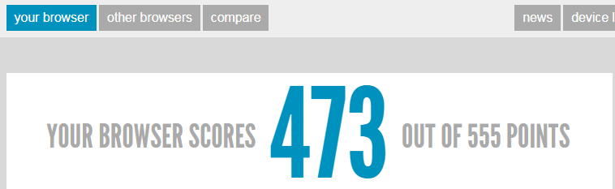
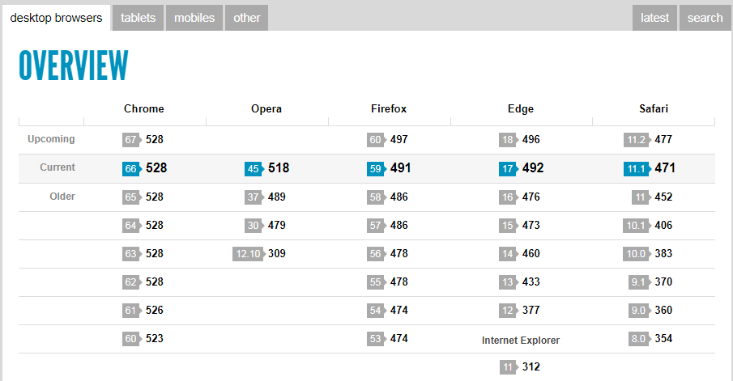
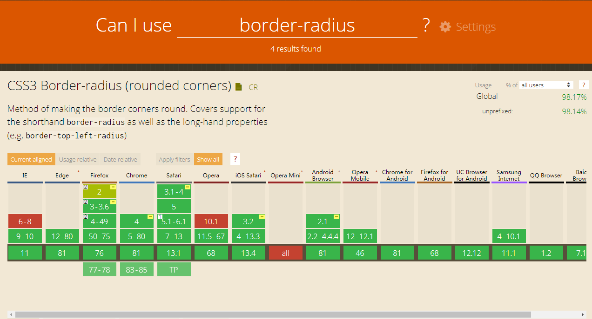
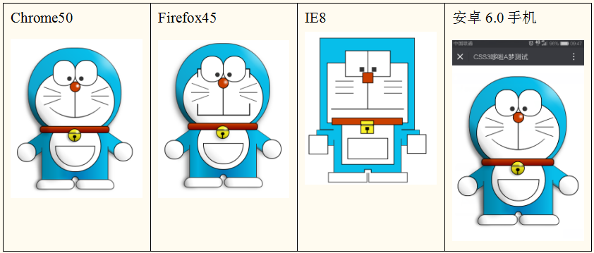

# html5 第一天

## 一、IFC

### 基线

1 inline元素的边缘是content-box

2 inline-block元素的边缘是margin-box

3 inline-block元素，如果没有内容，则基线与下边界对齐

4 inline-block元素，如果有内容，则基线与内容的基线对齐

5 inline-block元素，如果有多行内容，则基线与最后一行内容的基线对齐

6 inline元素，基线就是内容的基线

## 二、HTML5 与标签语义化

### html5 概述

我们之前学习的是HTML4.01（XHTML1.0）。2014年10月29日，万维网联盟泪流满面地宣布，经过

几乎8年的艰辛努力，HTML5标准规范终于最终制定完成了，并已公开发布。

HTML5 是 HTML 标准的最新演进版本。 这个术语代表了两个不同的概念：

1. 它是一个新的 HTML 语言版本包含了新的元素，属性和行为
2. 同时包含了一系列可以被用来让 Web 站点和应用更加多样化，功能更强大的技术（API）

### html5 的改变

- 语义：能够让你更恰当地描述你的内容是什么。
- 连通性：能够让你和服务器之间通过创新的新技术方法进行通信。
- 离线 & 存储：能够让网页在客户端本地存储数据以及更高效地离线运行。
- 多媒体：使 video 和 audio 成为了在所有 Web 中的一等公民。
- 2D/3D 绘图 & 效果：提供了一个更加分化范围的呈现选择。
- 性能 & 集成：提供了非常显著的性能优化和更有效的计算机硬件使用。
- 设备访问 Device Access：能够处理各种输入和输出设备。
- 样式设计: 让作者们来创作更加复杂的主题吧！

注：HTML5的改变，涵盖了CSS3和JS的一些新特性，这些东西统称HTML5技术。

### html5 兼容性

官方HTML5浏览器性能评分：http://html5test.com/，满分555分，1个特性就是1分，一共555个新

特性。

PC 使用 html5 新的属性需要稍微注意，但是移动端使用内核（webkit）支持情况非常，移动端可以

大胆使用各种html5.





### html5 能力检测

caniuse.com网站可以检索任何一个HTML5新特性，在各个浏览器里面的兼容情况。比如我们检索

border-radius的支持情况：



### html5 测试

哆啦A梦测试，这是测试CSS3的：

​	http://www1.pconline.com.cn/pcedu/specialtopic/css3-doraemon/



### html5 语法

骨架：书写骨架第一步就是DTD：＜!DOCTYPE　html＞

​	注意：DTD没有数字5，采用标准模式解析。浏览器对于不认识的属性或者标签，浏览器按照默认

方式处理，不报错。对于认识的属性或者标签，直接渲染。

字符集：<meta charset="UTF-8">

语法：

- ​	单标签（自封闭标签）可以不书写关闭符号/  。（可以）
- ​	标签的type属性可以不书写。（可以）
- ​	标签的属性值可以不用双引号包裹。（坚决不让用）
- ​	标签可以使用大写字母。（坚决不让用）

### html5 语义化标签

HTML就是负责页面语义的，HTML4.01中，div负责的任务太多，具体的语义没有拆分。

HTML5中，就是把div拆分为了更多的标签：```<section>, <article>, <nav>, <header>,<footer>, <aside>```

这些标签都和div一样，是容器级标签，可以互相嵌套，放什么都行，放自己也行。都是block-level，

标准流中是块级元素。

其它的语义化标签：

> ​	figure和figcaption：文档中插入图像
>
> ​	time：时间语义化标签，是行内元素
>
> ​	mark：有强调的语义
>
> ​	details和summary：总结含义的标签

```html
<!DOCTYPE html>
<html lang="en">
<head>
    <meta charset="UTF-8">
    <meta name="viewport" content="width=device-width, initial-scale=1.0">
    <title>Document</title>
</head>
<body>
    <!-- 导航部分 -->
    <nav></nav>
    <!-- banner部分 -->
    <header></header>
    <!-- 核心内容 -->
    <section>
        <!-- 文章 -->
        <article></article>
        <!-- 侧边栏 -->
        <aside></aside>
    </section>
    <!-- 页脚 -->
    <footer></footer>
    <!-- 插入图片 -->
    <figure>
        <!-- 添加标题 -->
        <figcaption>斗地主棋牌游戏</figcaption>
        
    </figure>
    <!-- 时间 -->
    <p>【<time>2019年11月28日</time>】中国领先的网络棋牌类游戏开发及运营商-博雅互动国际有限公司（「博雅互动」或「公司」，连同其附属公司，统称「集团」，股份代号：0434），今天欣然公布截至二零一九年九月三十日止三个月及九个月（「报告期内」）的未经审计综合业绩（「第三季度业绩」）。</p>
</body>
</html>
```


### html5 表单元素

> form可以不包裹表单元素，需要通过 id 定义名称，表单控件使用form属性产生绑定。
>
> label标签不用使用for产生绑定，直接包裹要绑定的单选框或者是复选框。
>
> placeholder：输入框提示的文案
>
> autofocus：自动获取焦点
>
> required：表单必填项
>
> 智能感应：使用datalist标签和要产生感应的表单元素产生绑定。
>
> ​	input 设置 list 属性，指向 datalist 的 id 属性。
>
> html5表单不但是语义变化，在提交时会进行正则验证。

### html5 表单类型

> search：		搜索框
>
> tel：			电话
>
> url：			统一资源定位符
>
> number：	数字
>
> email：		电子邮箱
>
> range：		拖拽条
>
> date：		日期
>
> week：		周
>
> color:		颜色

```html
<form action="/demo" id="demo">
    <!-- 字段 -->
    <input type="hidden" name="color" value="red">
    <!-- 输入框 -->
    <input type="text" value="请输入用户名">
    <!-- 提示信息 -->
    <input type="text" placeholder="请输入用户名">
    <hr>
    <!-- 自动获取焦点 -->
    <input type="text" autofocus>
    <!-- 智能感应 -->
    <input type="text" list="color">
    <datalist id="color">
        <option>red</option>
        <option>pink</option>
        <option>green</option>
        <option>orange</option>
        <option>yellowgreen</option>
        <option>yellow</option>
        <option>gold</option>
    </datalist>
    <!-- 提交按钮 -->
    <!-- <button>提交</button> -->
</form>
<!-- 表单外面定义按钮 -->
<button form="demo">提交</button>
<hr>
<!-- 表单控件类型 -->
<form action="">
    <input type="search">
    <input type="tel">
    <input type="url">
    <input type="number">
    <input type="email">
    <input type="range">
    <input type="date">
    <input type="week">
    <input type="color">
    <input type="text">
    <button>提交</button>
</form>
```

