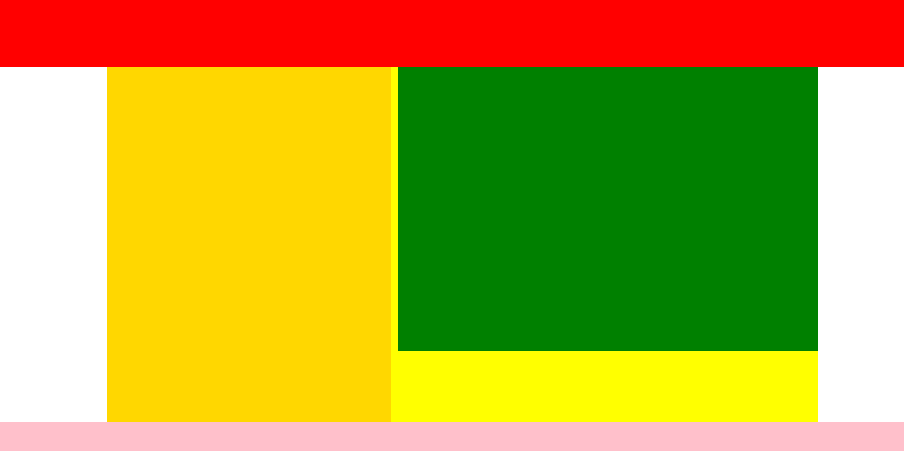

# CSS3 第三天

## 复习

字体阴影： text-shadow: x, y, r, color,

背景拓展：

​	颜色， 图片， 

​	background-origin: border-box, padding-box, content-box.

​	background-clip 

​	background-size	cover, contain

​	多背景：background,

​	渐变：-webkit-linear-gradient()		-webkit-radial-gradient()

过渡	transition	all  time

变换	transform:  rotate(deg)	scale(1)	skew()	translate

动画	@keyframes name { from {}  to {} }	animation name 1s 

# 一、3D

### 1.1 纬度

2d中的坐标系只有两个维度：

> ​	x 表示正方向向右  	
>
> ​	y表示正方向向下

3d中的坐标系有三个维度：

> ​	x 表示正方向向右 	
>
> ​	y表示正方向向下	 
>
> ​	z表示垂直于屏幕，正方向向前

translate表示空间位移，此时维度对盒子具有意义。

​	当元素具有translate属性的时候，如果之前发生了旋转，那么这个旋转并不是单纯的旋转元素本

身，而是它所在的整个坐标系都在旋转。

​	此时只设置translateZ，盒子没有任何变化，明明

​	应该盒子向着我们移动300px，盒子应该变大才对，

​	但是为什么盒子没有变化呢？

​		这是因为，我们舞台没有景深。

 

### 1.2 景深

景深表示场景深度。规定父元素距离屏幕有多远。

​	比如，人在看戏的时候，距离舞台有远有近。景深就表示舞台与人的距离。

​	第一排的人的景深小。最后一排的人景深大。演员在表演的时候移动，对应的第一排的人感觉演员

运动的幅度大。最后一排的人感觉演员运动幅度小。

通过perspective属性设置景深，在舞台有景深的前提下，一个盒子能够实现沿x、y、z轴的空间移

动。

可以通过translate3D属性来设置三个方向的移动距离：translate3D(30px,40px,100px)

也可以分开单独设置

> ​		transform:translateX(30px)
>
> ​		transform:translateY(40px)
>
> ​		transform:translateZ(100px)

舞台自己发生了旋转，那么在默认情况下，自己内部的元素是不能保留自己的3D轴的。

想让一个旋转了的舞台内部的演员保留自己的3D轴，那么就要使用：transform-style:preserve-3d属

性

```html
<!DOCTYPE html>
<html lang="en">
<head>
    <meta charset="UTF-8">
    <meta name="viewport" content="width=device-width, initial-scale=1.0">
    <title>Document</title>
    <style>
        .container {
            width: 331px;
            height: 195px;
            border: 2px solid green;
            margin: 50px auto;
            /* 沿着y轴旋转 */
            transform: rotateY(30deg);
            /* 让3d生效 */
            transform-style: preserve-3d;
            /* 设置景深 */
            perspective: 1000px;
            position: relative;
        }
        img {
            position: absolute;
        }
        /* 垂直屏幕方向，向用户移动300px */
        .img1 {
            transform: translateZ(300px);
        }
        .img2 {
            transform: translateZ(-300px);
        }
    </style>
</head>
<body>
    <div class="container">
        
        
    </div>
</body>
</html>
```


### 1.3 变换

transform-origin: 		改变旋转轴中心，可以接收两个参数

> ​	可以单词法	
>
> ​	可以是像素法	
>
> ​	可以是百分比

​	注意：2D中，相当于点旋转，3D中，相对于坐标轴旋转

backface-visibility: hidden		背面不可见3D 变换总结

- translate3d(x,y,z)		定义 3D 移动

​		代表：translateX(x)，translateY(y)，translateZ(z)

- scale3d(x,y,z)			定义 3D 缩放

​		代表：scaleX(x)，scaleY(y)，scaleZ(z)

- rotate3d(x,y,z,angle)	定义 3D 旋转

​		代表：rotateX(angle)，rotateY(angle)，rotateZ(angle)

```html
<!DOCTYPE html>
<html lang="en">
<head>
    <meta charset="UTF-8">
    <meta name="viewport" content="width=device-width, initial-scale=1.0">
    <title>Document</title>
    <style>
        .container {
            width: 331px;
            height: 195px;
            border: 2px solid green;
            margin: 50px auto;
            /* 3d渲染 */
            transform-style: preserve-3d;
            /* transform: rotateX(30deg) rotateY(30deg) ; */
            perspective: 1000px;
        }
        /* 内部的图片旋转 */
        .img1 {
            /* transform: rotateY(60deg); */
            /* 有了景深，就可以看出旋转的效果 */
            /* transform: rotateX(60deg); */
            /* 一条线，看不到了 */
            /* transform: rotateX(90deg); */
            /* 180度就是翻转了, 看到的是后面，倒置的 */
            /* transform: rotateX(180deg); */
            /* transform: rotateX(300deg); */
            /* 背面不可见 */
            /* backface-visibility: hidden; */
            
            /* 更改旋转轴 */
            transform-origin: left top;
            transition: all 3s;
        }
        body {
            text-align: center;
        }
        .img1:hover {
            /* transform: rotateX(180deg); */
            transform: rotateY(180deg);
        }
        /* 2d相对于点旋转 */
        .img2 {
            transform-origin: left top;
            transition: all 2s;
        }
        .img2:hover {
            transform: rotate(180deg);
        }
    </style>
</head>
<body>
    <div class="container">
        
    </div>
    
</body>
</html>
```


### 1.4 立方体

制作立方体步骤：

1. ​	父元素设置保留子元素的3D属性 transform-style: preserve-3d
2. ​	父相子绝
3. ​	前后面直接translate: 正负宽度的一半
4. ​	上下面先沿x轴旋转90度，translate: 正负宽度的一半
5. ​	左右面先沿y轴旋转90度，translate: 正负宽度的一半

```html
<!DOCTYPE html>
<html lang="en">
<head>
    <meta charset="UTF-8">
    <meta name="viewport" content="width=device-width, initial-scale=1.0">
    <title>Document</title>
    <style>
        /* 动画 */
        @keyframes ickt {
            from {
                /* transform: rotateX(30deg) rotateY(30deg); */
                transform: rotateX(0deg) rotateY(60deg);
            }
            to {
                /* 旋转360deg */
                /* transform: rotateX(390deg) rotateY(390deg); */
                transform: rotateX(360deg) rotateY(240deg);
            }
        }
        /* 容器 */
        .container {
            width: 300px;
            height: 300px;
            margin: 200px auto;
            border: 3px solid #000;
            position: relative;
            /* 3d渲染 */
            transform-style: preserve-3d;
            /* 给容器一个角度，就可以看到其它的面了 */
            /* transform: rotateX(30deg) rotateY(30deg); */
            /* 对整个舞台使用动画 */
            animation: ickt 5s linear infinite;
            /* 为了看到2，沿着y轴旋转 */
            /* transform: rotateY(160deg); */
            /* transform: rotateX(-90deg); */
        }
        .box {
            position: absolute;
            font-size: 100px;
            line-height: 300px;
            width: 300px;
            height: 300px;
            text-align: center;
            color: #fff;
        }
        /* 正面的 */
        .box1 {
            background-color: pink;
            transform: translateZ(150px);
        }
        /* 后面 */
        .box2 {
            background-color: orange;
            transform: translateZ(-150px) rotateY(180deg);
            backface-visibility: hidden;
        }
        /* 左侧 */
        .box3 {
            background-color: skyblue;
            transform: translateX(-150px) rotateY(-90deg);
        }
        /* 右侧 */
        .box4 {
            background-color: yellowgreen;
            transform: translateX(150px) rotateY(90deg);
        }
        /* 上面的 */
        .box5 {
            background-color: gold;
            transform: translateY(-150px) rotateX(90deg);
        }
        /* 下面的 */
        .box6 {
            background-color: green;
            transform: translateY(150px) rotateX(-90deg);
        }
    </style>
</head>
<body>
    <div class="container">
        <div class="box box1">1</div>
        <div class="box box2">2</div>
        <div class="box box3">3</div>
        <div class="box box4">4</div>
        <div class="box box5">5</div>
        <div class="box box6">6</div>
    </div>
</body>
</html>
```


## 二、布局

## 2.1 浮动布局

布局效果：

- ​	头部区域自适应
- ​	尾部区域自适应
- ​	中间区域固定宽度

包含两个固定宽度的模块，并且并列渲染

​	两个盒子，一个浮动，一个在文档流上

中间的内容区域自适应（例如：80%居中）此时当页面小于内容区域最小盒子宽度的时候，头部和尾

部显示不全了，我们可以让页面的最小宽度不小于该宽度即可

> ​	min-width 设置最小宽度
>
> ​	min-height 设置最小高度
>
> ​	max-width 设置最大宽度
>
> ​	max-height 设置最大高度



```html
<!DOCTYPE html>
<html lang="en">
<head>
    <meta charset="UTF-8">
    <meta name="viewport" content="width=device-width, initial-scale=1.0">
    <title>Document</title>
    <style>
        header {
            height: 50px;
            background-color: red;
            min-width: 1000px;
        }
        section {
            background-color: yellow;
            overflow: hidden;
            width: 80%;
            margin: 0 auto;
            /* 最小宽度 */
            min-width: 800px;
        }
        article {
            float: left;
            height: 500px;
            background-color: gold;
            width: 300px;
        }
        .slider {
            margin-left: 310px;
            height: 300px;
            background-color: green;
            
        }
        footer {
            height: 40px;
            background-color: pink;
            min-width: 1000px;
        }
    </style>
</head>
<body>
    <header></header>
    <section>
        <article></article>
        <div class="slider"></div>
    </section>
    <footer></footer>
</body>
</html>
```


### 2.2 列表布局

模型：在一个固定宽度的盒子内，均匀放置盒子，使他们之间的边距一致

特点：盒子的宽度是一样的，盒子之间的边距时一样的

布局公式：容器的宽度 w，盒子的宽度是 iw，边距 m，放置盒子的数量 n

​	w = n * iw + (n - 1) * m

根据这个公式，如果三个变量是已知的，我们可以求第四个变量

注意，布局的时候，每个盒子都要设置右边距，此时容器应该比原有的

宽度多出一个边距来，我们可以通过修改margin来解决（在没有显性设

置宽度的时候，我们可以通过margin修改容器的宽度）


```html
<!DOCTYPE html>
<html lang="en">
<head>
    <meta charset="UTF-8">
    <meta name="viewport" content="width=device-width, initial-scale=1.0">
    <title>Document</title>
    <style>
        * {
            margin: 0;
            padding: 0;
            list-style: none;
        }
        /* 作用：设置宽度并居中 */
        .container {
            width: 1000px;
            margin: 0 auto;
        }
        ul {
            /* 没有设置width，因此可以通过负margin改变宽度 */
            background-color: pink;
            overflow: hidden;
            margin-right: -20px;
        }
        /* 1000 = iw * 5 + (5 - 1) * 20 */
        /* iw = (1000 - (5 - 1) * 20) / 5 */
        li {
            float: left;
            width: 184px;
            height: 150px;
            background-color: green;
            margin-right: 20px;
            margin-bottom: 20px;
            font-size: 50px;
            color: #fff
        }

    </style>
</head>
<body>
    <div class="container">
        <ul>
            <li>1</li>
            <li>2</li>
            <li>3</li>
            <li>4</li>
            <li>5</li>
            <li>6</li>
            <li>7</li>
            <li>8</li>
            <li>9</li>
            <li>10</li>
            <li>11</li>
            <li>12</li>
            <li>13</li>
            <li>14</li>
            <li>15</li>
            <li>16</li>
            <li>17</li>
            <li>18</li>
            <li>19</li>
            <li>20</li>
        </ul>
    </div>
</body>
</html>
```


### 2.3 两翼齐飞（双飞翼）布局

两翼齐飞又叫双飞翼布局，是一个三列布局，中间自适应宽度，两翼固定宽度的一种布局模型

经典布局方案

1. 三个容器在一排，所以我们可以使用浮动布局
2. 中间的自适应，我们可以让其占一整行，然后让子元素通过margin居中来自适应
3. 后面橘黄色的元素，要放在最前面，移动了是绿色元素父容器的宽度，向左平移，所以设置负值
4. 后面蓝色的元素，要放在最后面，根据浮动贴边特性，只需要向前移动蓝色盒子的宽度即可

简化版（固比固布局）：就是中间自适应，左右固定，所以可以并列三个元素，前面两个脱离文档流

（浮动），一左一右，设置固定宽度即可


```html
<!DOCTYPE html>
<html lang="en">
<head>
    <meta charset="UTF-8">
    <meta name="viewport" content="width=device-width, initial-scale=1.0">
    <title>Document</title>
    <style>
        .main {
            float: left;
            background-color: gray;
            width: 100%;
            height: 300px;
        }
        /* 居中自适应宽度 */
        .content {
            margin: 0 320px;
            height: 450px;
            background-color: green;
        }
        .left {
            float: left;
            background-color: orange;
            height: 400px;
            width: 300px;
            margin-left: -100%;
        }
        .right {
            float: left;
            background-color: blue;
            height: 500px;
            width: 300px;
            margin-left: -300px;
        }
    </style>
</head>
<body>
    <!-- 中间自适应宽度 -->
    <div class="main">
        <div class="content"></div>
    </div>
    <!-- 显示在左侧 -->
    <div class="left"></div>
    <!-- 显示在右侧 -->
    <div class="right"></div>
</body>
</html>
```


### 2.4 圣杯布局

模型，三列（多列）等高，宽度自适应

特点

1. 它们在一行，因此要浮动布局

2. 它们宽度自适应，因此我们用百分比设置宽度

3. 它们可能有不同的高度（可以手动设置）

4. 浮动布局，让父元素具有高度，我们要设置overflow（清除浮动），一旦为父元素设置

    overflow，从最大高度开始截取

5. 为了弥补高度差，我们要填充高度，我们设置padding-bottom可以让盒子增高，我们设置

    margin-bottom负值，可以降低高度，综合使用他们即可弥补高度差，所以设置的margin-

    bottom和padding-bottom要足够大：最大高度-最小高度 

    增加多少，降低多少，高度维持不变

```html
<!DOCTYPE html>
<html lang="en">
<head>
    <meta charset="UTF-8">
    <meta name="viewport" content="width=device-width, initial-scale=1.0">
    <title>Document</title>
    <style>
        .container {
            width: 80%;
            margin: 0 auto;
            border: 3px solid #000;
            overflow: hidden;
        }
        .box1 {
            float: left;
            width: 20%;
            height: 300px;
            background-color: red;
            /* 填充空间 */
            padding-bottom: 500px;
            /* 通过父margin，让盒子占用的空间减少 */
            margin-bottom: -500px;
        }
        .box2 {
            float: left;
            width: 50%;
            height: 500px;
            background-color: green;
            padding-bottom: 500px;
            margin-bottom: -500px;
        }
        .box3 {
            float: left;
            width: 30%;
            height: 400px;
            background-color: blue;
            padding-bottom: 500px;
            margin-bottom: -500px;
        }
    </style>
</head>
<body>
    <div class="container">
        <div class="box1"></div>
        <div class="box2"></div>
        <div class="box3"></div>
    </div>
</body>
</html>
```


### 2.5 百分比布局

百分比布局，也叫作流式布局。

用百分比为单位，最最重要的事情，就是参考谁，是谁的百分比？

> ​	width：参考的是父盒子的width。(注意，是内容的宽度不算padding)。如果没有父盒子，此
>
> 时父盒子就是body，参考的就是浏览器的页面宽度。
>
> ​	height：参考的是父盒子的height。
>
> ​	padding：参考的是父盒子的width。注意，无论是哪个方向的padding都是参考的是父盒子的
>
> width。
>
> ​	margin：参考的是父盒子的width。注意，无论是哪个方向的margin都参考的是父盒子的
>
> width。
>
> ​	border不能用%写，可以通过box-sizing来更改盒模型，
>
> 如果是绝对定位
>
> ​		子盒子width：百分比参考的是距离最近，且有定位的父盒子的width（算上padding.）
>
> ​		子盒子height：百分比参考的是距离最近，且有定位的父盒子的height（算上padding.）
>
> ​		子盒子padding,margin：百分比参考的是距离最近，且有定位的父盒子的width（算上
>
> padding.）

```html
<!DOCTYPE html>
<html lang="en">
<head>
    <meta charset="UTF-8">
    <meta name="viewport" content="width=device-width, initial-scale=1.0">
    <title>Document</title>
    <style>
        .ickt {
            padding: 100px;
            width: 1000px;
            height: 500px;
            position: relative;
        }
        .container {
            width: 800px;
            padding: 100px;
            height: 400px;
            border: 10px solid green;
            margin: 0 auto;
        }
        .box {
            width: 10%;
            height: 10%;
            background-color: pink;
            padding: 10%;
            margin: 10%;
            /* position: absolute; */
        }
    </style>
</head>
<body>
    <div class="ickt">
        <div class="container">
            <div class="box"></div>
        </div>
    </div>
    
</body>
</html>
```


## 三、视口

### 3.1 视口

分辨率：就是屏幕像素的数量，比如1600*900，指的是横向有1600的像素点，

纵向有900个像素点。所谓的像素点是物理元件最小的发光单位。

手机的分辨率是多少呢？非常的大，如今大屏手机能达到1920×1080

如果手机真的用自己的真实分辨率，来呈递网页，就是这种情况了：

​	就像在3000米的高空，俯瞰整个页面。字非常小，h1巨小。

有的同学说，这样挺好，正好可以把整个网页一目了然的看全。乔布斯也这么想。

乔布斯说，手机可以呈递电脑网页，但是网页制作者还来不及制作，所以此时我

们如果设置手机的一个宽度为980px，而实际上的网页的版心（网页内容区域），

绝大多是都是980px，岂不是手机刚好卡住了整个版心么？

乔布斯在iPhone1就命令工程师，把自己的手机的浏览器，认为自己是980px

宽，而不是像素宽度，这个宽度就是视口。


### 3.2 视口宽度

我们可以通过JS语句来获取浏览器的宽度：document.documentElement.clientWidth;

​	显示980！而iphone的横向的像素数量不是980！

我们发现班级里面所有同学的所有设备，这个测试的结果都是980。

这个数字就是视口宽度，viewport。980是所有设备的初始视口宽度。浏览器会以980这个宽度来渲

染页面。

也就是说，我们做前端开发的，完全没有必要关心手机的分辨率！

但是980对于手机页面来说太大了。所以乔帮主又做了一个精妙的设计，就是能够让页面的开发者，

自定义设置移动设备的视口宽度。可以用这样的meta标签，来设置视口的宽度：

	<meta name="viewport" content="width=300" />

一旦设置了，浏览器此时就会认为自己的宽度是300px。此时就会按照300px的宽度来渲染页面。

viewport太好用了，通过该属性，我们可以修改视口的宽度了。

我们发现：不同的视口大小，呈递相同的页面，给人的感觉，是不一样的，尤其是看文字，h1的默认

字号32px。如果你的视口是980px，此时看文字非常小。此时如果视口是320左右，此时刚刚好：

此时就有一个换算关系，什么关系呢？

如果让一个300px的盒子，在电脑上看，和在手机上看的物理长度一样！就是我们用尺子量，结果是

一样宽的。


### 3.3 缩放因子DPR（设备像素比）

DPR（DevicePixelRatio）：手机的物理像素与实际使用像素的缩放比，早期的iPhone3GS的屏幕屏

幕分辨率是320 * 480，这个时候的DPR是1。iOS绘制图形（CGPoint/CGSize/CGRect）均以point为

单位： 1 point = 1 pixel

后来在iPhone4中，同样大小（3.5inch）的屏幕采用Retina(视网膜)屏幕显示技术（同样的尺寸，像

素多了一倍），横、纵向方向像素密度都被放大到2倍，像素分辨率提高到（320 * 2） * （480 * 2） 

= 640 * 960，显像分辨率提高到iPhone3GS的4倍。

DPR的计算公式：DPR = 单位长度内（pixel/point）;*如ipone6中的scale的值 = 750px / 375pt = 2.0

所以任何手机如果想要有显示和计算机一样的宽度，就要根据自己的分辨率、DPR的不同，而设置不

同的视口。

如果我们加上：<meta name="viewport" content="width=device-width" />

此时每个手机的视口宽度，都是“视口约束宽度”。

每个手机的视口约束宽度不一样，这是为了给人看上去的物理感觉是一样的：

各个设备约束视口之后的视口宽度（300-420）

你会发现这个宽度都不一样，但是此时人看上去的感觉是一样的。字号是一样大的。

### 3.4 viewport

开发手机页面的时候，一定要加上：

	<meta name="viewport" content="width=device-width, initial-scale=1.0, minimum-scale=1.0, maximum-scale=1.0,user-scalable=no" id="viewport" />

> ​	width=device-width  	约束视口
>
> ​	initial-scale=1.0   		初始视口倍数是1倍
>
> ​	minimum-scale=1.0   	最小允许视口宽度是1倍
>
> ​	maximum-scale=1.0  	最大允许视口宽度是1倍	
>
> ​	user-scalable=no   		不允许用户缩放视口

​	此时如果你写一个p的字号为font-size:14px;不用担心用户能不能看清！用户一定能看的清清楚楚

的！此时厂商已经计算好了一个所谓视口约束宽度。14px和14px的感觉完全一样！

​	一般来说，手机视口约束之后都是320~420之间。而分辨率基本上都是1000~1200，也就是说，约

束视口之后，所谓的1px，实际上手机用了2点多个像素来渲染。手机中的图片，必须使用放大两倍的

图片缩小使用，这样能精细（不会导致图片放大后失真）。

```html
<!DOCTYPE html>
<html lang="en">
<head>
    <meta charset="UTF-8">
    <!-- 更改视口宽度 -->
    <!-- <meta name="viewport" content="width=100"> -->
    <meta name="viewport" content="width=device-width">
    <title>Document</title>
</head>
<body>
    <h1>爱创课堂</h1>
    <div style="width: 80px; height: 50px; background-color: orange;"></div>
</body>
</html>
```

