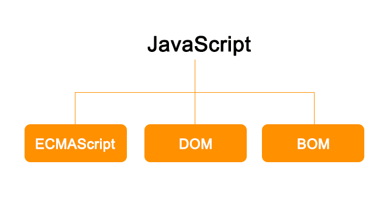
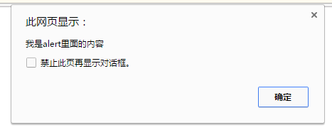

# JavaScript 第一天

## 一、JavaScript 概述

### 1.1 JavaScript 简介

前端的三层：

> ​	结构层	html			从语义的角度搭建网页结构
>
> ​	样式层	css			从装饰的角度美化页面
>
> ​	行为层  	Javascript	从交互的角度描述我们的页面行为

用途：数据验证、读写HTML元素、与浏览器窗口及其内容的交互效果、网页特效、WEB游戏制作

​	基于Node.js技术进行服务器端编程


### 1.2 javascript 发展史

​	在WEB日益发展的同时，网页的大小和复杂性不断增加，受制于网速的限制，为完成简单的表单验证而频繁地与服务器交换数据只会加重用户

的负担，当时走在技术革新最前沿的Netscape（网景） 公司，决定着手开发一种客户端语言，用来处理这种简单的验证。

​	1995年，就职于Netscape 公司的布兰登·艾奇（Brendan Eich），开始着手为即将于1996年2月发布的Netscape Navigator 2浏览器开发一种

名为LiveScript 的脚本语言。为了尽快完成LiveScript 的开发，Netscape 与Sun 公司建立了一个开发联盟。在Netscape Navigator 2 正式发布

前夕，Netscape 为了搭上媒体热炒Java 的顺风车，临时把LiveScript 改名为JavaScript。

​	由于JavaScript1.0获得的关注度越来越高，1996年，微软就在其Internet Explorer 3 中加入了名为JScript 的JavaScript 实现，这意味着有了两

个不同的JavaScript 版本，导致JavaScript没有一个标准化的语法和特性。

1997 年，以JavaScript 1.1 为蓝本的建议被提交给了欧洲计算机制造商协会（ECMA，European Computer Manufacturers Association）。该

协会指定39 号技术委员会（TC39，Technical Committee #39）负责“ 标准化一种通用、跨平台、供应商中立的脚本语言的语法和语义”。TC39 

由来自Netscape、Sun、微软、Borland 及其他关注脚本语言发展的公司的程序员组成，他们经过数月的努力完成了ECMA-262标准，定义一种

名为ECMAScript的新脚本语言。

布兰登·艾奇（1961年～），JavaScript的发明人，目前（2005年至2014年）在Mozilla公司担任CTO。2014年4月3日，出任Mozilla的CEO十天

就被迫辞职。


### 1.3 ECMAScript 版本发展

​	1998年6月，ECMAScript 2.0版发布。

​	1999年12月，ECMAScript 3.0版发布，成为JavaScript的通行标准，得到了广泛支持。

​	2007年10月，ECMAScript 4.0版草案发布，对3.0版做了大幅升级。草案发布后，由于4.0版的目标过于激进，各方对于是否通过这个标准，发

生了严重分歧。以Yahoo、Microsoft、Google为首的大公司，反对JavaScript的大幅升级，主张小幅改动；以JavaScript创造者Brendan Eich为

首的Mozilla公司，则坚持当前的草案。

​	2008年7月，由于各方分歧太大，争论过于激进，ECMA开会决定，中止ECMAScript 4.0的开发，将其中涉及现有功能改善的一小部分，发布

为ECMAScript 3.1，而将其它激进的设想扩大范围，放入以后的版本。会议气氛和谐，故该版本的项目代号起名为Harmony（和谐）。会后不

久，ECMAScript 3.1就改名为ECMAScript 5。

​	2009年12月，ECMAScript 5.0版正式发布。Harmony项目则一分为二，一些较为可行的设想定名为JavaScript.next继续开发，后来演变成

ECMAScript 6；一些不是很成熟的设想，则被视为JavaScript.next.next，在更远的将来再考虑推出。

​	2011年6月，ECMAscript 5.1版发布，并且成为ISO国际标准（ISO/IEC 16262:2011）。

​	2013年3月，ECMAScript 6草案冻结，不再添加新功能。新的功能设想将被放到ECMAScript 7。

​	2013年12月，ECMAScript 6草案发布。然后是12个月的讨论期，听取各方反馈。

​	2015年6月17日，ECMAScript 6发布正式版本，即ECMAScript 2015。

​	2015版本也就是6版本，将来在我们最后面的课程。

### 1.4 JavaScript 脚本语言

Javascript，JScript，ActionScript等脚本语言都是基于ECMAScript标准实现的。

在JavaScript，JScript和ActionScript中声明变量，操作数组等语法完全一样，因为它们都是ECMAScript。但是在操作浏览器对象等方面又有各

自独特的方法，这些都是各自语言的扩展。

JavaScript是由ECMAScript，DOM和BOM三者组成的。

JavaScript语言简称JS。



### 1.5 JavaScript 书写位置

JavaScript 是一门弱类型动态的脚本语言。在页面中使用JavaScript有三种方式：

* **行内式**：在元素的事件属性中书写，由于写在html中，导致代码冗余，因此不常用。

    ​	如：onclick属性等

* **内嵌式**：可以书写body标签内部的一对script标签中（学习中常用）。

    ​	script标签有一个属性type,属性值是“text/javascript”表示书写的是纯文本的javascript语言。

* **外链式**：通过外部引入js文件，将引入文件书写head标签内部（工作中常用），通过 src 属性引入文件地址。

    ​	JavaScript 文件扩展名是.js，JavaScript 也可以简称 js

    ​	js文件的书写：直接在js文件中书写我们想显示的内容。

    ​	js脚本语言不能直接在浏览器中加载，必须依托html载体实现。

```html
<!DOCTYPE html>
<html lang="en">
<head>
    <meta charset="UTF-8">
    <meta name="viewport" content="width=device-width, initial-scale=1.0">
    <title>Document</title>
    <!-- 2 内嵌式  -->
    <!-- <script type="text/javascript"></script> -->
    <!-- 3 外链岁 -->
    <!-- <script type="text/javascript" src="./js/01.js"></script> -->
</head>
<body>
    <!-- 1 行内式 -->
    <button onclick="">按钮</button>
    <!-- 2 内嵌式  -->
    <script type="text/javascript"></script>
    <!-- 3 外链岁 -->
    <script type="text/javascript" src="./js/01.js"></script>
</body>
</html>
```


### 1.6 alert

alert() 方法是js内置的方法（功能）。直接调用不用书写调用对象。

alert()表示弹出框，警告框。

alert()方法后面直接跟小括号()，小括号内书写内容，内容需要使用双引号包裹，语句结束必须书写分号。

js解析器的工作原理：js解析器是一条一条语句解析的，当看到分号时，知道这是一条语句的结束。如果没有分号，解析器会一直解析直到遇见

分号。所以书写js语句要求大家每一条语句必须用分号结尾。

下面这段代码可以正常解析，因为每一行语句都换行。但是不能这样书写。因为js代码在上线前会压缩代码，将所有的换行，空格，缩进都删

掉，如：

​	alert("第一条语句")

​	alert("第二条语句")	



### 1.8 语句

分号的重要性

​	每一条js语句必须书写分号，标识每一行语句的结束，提高解析器的工作效率

alert（）语句的执行顺序

​	从上到下顺序执行（包括多个 script 标签）。

alert()语句对空格，缩进，换行不敏感

```html
<!DOCTYPE html>
<html lang="en">
<head>
    <meta charset="UTF-8">
    <meta name="viewport" content="width=device-width, initial-scale=1.0">
    <title>Document</title>
    <!-- 2 内嵌式  -->
    <!-- <script type="text/javascript"></script> -->
    <!-- 3 外链岁 -->
    <!-- <script type="text/javascript" src="./js/01.js"></script> -->
    <style>
        button {
            /* 写在一行，必须用;隔开 */
            color: red; font-size: 50px;
        }
    </style>
</head>
<body>
    <!-- 1 行内式 -->
    <!-- 双引号中只能嵌套单引号，单一号中只能嵌套双引号 -->
    <!-- 注意：这里的分号，冒号，引号，逗号等等必须是英文的，不能是中文的 -->
    <!-- <button onclick="alert("hello")">按钮</button> -->
    <!-- 注意，在html规范中，属性值要使用双引号，因此建议属性值使用双引号，内部使用单引号 -->
    <button onclick="alert('hello')">按钮</button>
    <!-- <button onclick='alert("hello")'>按钮</button> -->
    <script type="text/javascript" src="./js/01.js"></script>
    <!-- 2 内嵌式  -->
    <script type="text/javascript">
        // 分号表示一句话的结束
        alert('第一句话1111');
        alert("第二句话2222");
    </script>
    <!-- 3 外链岁 -->
    <!-- <script type="text/javascript" src="./js/01.js"></script> -->
</body>
</html>
```


### 1.9 JavaScript 注释

**单行注释**：只能注释单行文本，如果换行将报错。

​	如：// 单行注释

​	快捷键：ctrl + /

**多行注释**：可以一次注释多行文本

​	如：/*

​			多行注释，

​			可以一次注释多行文本

​		*/

​	快键键：ctrl +shift + /

```html
<!DOCTYPE html>
<html lang="en">
<head>
    <meta charset="UTF-8">
    <meta name="viewport" content="width=device-width, initial-scale=1.0">
    <title>Document</title>
</head>
<body>
    <script>
        // 单行注释只能注释掉单行文本
        // hello 
        // ickt

        // 多行注释
        /* hello 
        
        
        ickt */

    </script>
</body>
</html>
```


### 1.10 console 面板

一般使用谷歌浏览器的控制台，是我们“审查元素”或者“检查”里面的一个功能面板，英文写作console，控制台的意思，快捷键是F12.

控制台会汇总我们代码中出现的错误，指出错误的类型，数量。

​	方便我们程序员调试代码。

控制台也可以输出一些内容，输出内容直接在控制台显示。

​	语句：console.log();

​		console本身也是js内置的一个对象，对象里有一个方法，叫做log，本身是日志的意思。

​		console.log()语句的作用是在控制台输出打印一些内容。

​	作用：可以在控制台直接书写一些语句。

```html
<!DOCTYPE html>
<html lang="en">
<head>
    <meta charset="UTF-8">
    <meta name="viewport" content="width=device-width, initial-scale=1.0">
    <title>Document</title>
</head>
<body>
<script>
    // hello
    // ickt
    // console语句输出内容
    console.log('hello');
    // 工作中，我们常常使用console去调试
    // alert(111);
    // console不会中断执行，alert会中断程序执行
    console.log(100);
</script>
</body>
</html>
```


## 二、字面量

### 2.1 字面量

字面量（literal）是用于表达一个固定值的表示法。也叫做直接量，或者叫常量。

​	说白了，字面量就是字面的意思，我们看到什么，就表示什么，值是确定不变的。

字面量可以用于表示固定值，

​	比如：数字、字符串、undefined、布尔类型的字面值等。

​	今天学习：数值字面量、字符串字面量

### 2.2 数学字面量

数字字面量就是我们常用的数字，没有任何其他辅助符号。

​	数字分类：**整数**、**浮点数（小数）**、**特殊值**

**整数字面量**

​	整数可以被表示成十进制（基数为10）、八进制（基数为8）以及十六进制（基数为16）。

- ​		十进制是最基本的数值字面量格式，可以直接在代码中输入。
- ​		八进制字面值必须带前导0、0O、0o 。八进制整数只能包括数字0-7。
- ​		十六进制的前缀是0x或0X。后面可以包含数字（0-9）和字母a~f或A~F。

​	在进行算术计算时，所有八进制和十六进制的数字都会被转换成十进制。

**浮点数字面量**：

​	浮点数：整数.小数。

​	有几种字面量表示方法。有整数位，没有整数位，负数，幂的表示方法（科学计数法）

​	重点记忆：幂的表示法。

​	浮点数，只有十进制有浮点数，八进制和十六进制都没有。

```html
<!DOCTYPE html>
<html lang="en">
<head>
    <meta charset="UTF-8">
    <meta name="viewport" content="width=device-width, initial-scale=1.0">
    <title>Document</title>
</head>
<body>
<script>
// 通过console.log将数据打印到console面板中
// // 整型
// console.log(100);
// console.log(-100);
// console.log(999);

// // 进制
// console.log(11);
// // 8进制
// console.log(011);
// console.log(0O11);
// console.log(0o11);
// console.log(0o17);
// // 在8进制中，当数字超过7就会报错。
// // console.log(0o19);
// // 如果以0开头的8进制数，如果数字大于7将作为10进制处理
// console.log(017);
// console.log(018);

// // 十六进制
// console.log('------ 十六进制 ------');
// console.log(0x11);
// console.log(0X11);
// console.log(0X1f);
// console.log(0X1F);
// // 十六进制中，字母不能超过F
// // console.log(0X1g);

// // 不论是什么进制，做算术运算的时候，结果为10进制
// console.log(0O12 * 2);
// console.log(0x12 * 2);


// 浮点数
// 有整数位
console.log(20.12);
console.log(0.12);
// 没有整数位会补0，建议不要整数位。
console.log(.12);
// 有负数
console.log(-10.12);
// 幂的形式
console.log(0.12e4)
console.log(0.12e-4)
</script>
</body>
</html>
```


**两个特殊值**：

​	**Infinity**，表示无穷大。我们的计算机的计算能力有限，有一个最大的计算值，有一个最小的计算值，超出这个范围，数字会输出为Infinity，

或者-Infinity。

​	**NaN,**英文not a number，不是一个数字，奇怪的是，它本身是一种数字的字面量。

```html
<!DOCTYPE html>
<html lang="en">
<head>
    <meta charset="UTF-8">
    <meta name="viewport" content="width=device-width, initial-scale=1.0">
    <title>Document</title>
</head>
<body>
<script>
// 无穷数（超过1.7976931348623157e+308）
console.log(1.7976931348623157e+308);
console.log(1.7976931348623157e+309);
console.log(1/0);
console.log(-1/0);
// 特殊单词表示
console.log(Infinity)
console.log(-Infinity)

// 如果一个小数比较接近0（小于5e-324），计算机还无法表示，此时将作为0来处理
console.log(5e-324);
console.log(5e-325);
// 如果负数比较接近0，计算机无法表示，将变成-0
console.log(-5e-324);
console.log(-5e-325);

// 非数字
console.log(NaN);
// 将字符串转成数字
console.log(+'hello');

// 可以通过0和1来实现-Infinify, +Infinify， 0， -0， NaN
console.log('---------------------');
console.log(-1/0);
console.log(1/0);
console.log(0/1);
console.log(0/-1);
console.log(0/0);

</script>
</body>
</html>
```


### 2.3 字符串

字符串，就是我们人类说的语言。包括各种类型的语言，特殊符号，说话中的数字。

字符串字面值可以包含零个或多个字符，由双引号对或单引号成对包围。字符串被限定在同种引号之间；也即，必须是成对单引号或成对双引

号。

​	在字符串中可以使用一些特殊字符，比如

​		\n	换行                 	

​		\t	Tab制表符	 

​	字符串中可以使用转义字符反斜杠\，

​		\'	单引号			

​		\”	双引号			

​		```\\```	反斜杠

```html
<!DOCTYPE html>
<html lang="en">
<head>
    <meta charset="UTF-8">
    <meta name="viewport" content="width=device-width, initial-scale=1.0">
    <title>Document</title>
</head>
<body>
<script>
// 字符串
console.log("你好");
console.log('hello');
// 成对出现的
// console.log('hello");
// console.log("hello');
// 单引号与双引号之间是可以相互嵌套的(只能嵌套一层，但是可以多次使用)(单引号字符串中，只能双引号，双信号字符串中，只能出现单引号)
console.log("hello' 'i'c''kt'");
console.log('hello" "ic"kt"');
// 想嵌套同类引号，要使用转义字符
console.log("hello \" ickt");
console.log('hello \' ickt');
// \表示转义符号，可以对任何字符转义，
// 第一个\对第二个\进行了转义，第三个斜杠对'进行转了
console.log('hello \\\' ickt');
console.log('hello \\   \' ickt');
// 如果在字母前添加\字母也会转义
// 字符串不能换行，想换行使用\n
// console.log('hello 
// ickt');
console.log('hello \nickt');
// 并不是所有的字符转义都有意义
console.log('\h\e\l\l\o \nickt');
// 注意：转义字符串是一个整体，不能拆开使用
console.log('h e\tllo \n \ n \nickt');
</script>
</body>
</html>
```


## 三、变量

### 3.1 变量

变量：variable（变量）

​	变量是变化的量，可以把变量看成可以盛放数据的容器。变量盛放可以是任何数据类型，比如字面量，函数，数组等。

​	变量输出的是变量存放的数据，而不是变量名。

​	当变量有多个赋值时，输出的是最后一次赋值，前面（旧的）赋值直接被舍弃。

### 3.2 变量声明

变量（Variables）声明，也叫定义变量或创建变量，可以用来保存任何类型的数据。

​	变量声明必须使用一个关键字var，关键字后面必须跟一个空格，然后再跟我们定义的变量名称。

​	变量必须先声明（关键字var）再使用。访问一个没有声明的变量，将抛出ReferenceError（引用错误）错误

​	变量名本身叫做标识符，任何标识符的命名都需要遵守一定的规则。

​		只能使用字母、下划线（_）、美元符号（$）或数字，但是不能是数字开头。

​	因为JavaScript语言是区分大小写的，这里所指的字母可以是（大写的）“A”到字母“Z”和（小写的）“a”到“z”。并且不能是JavaScript的关键字和

保留字。

​	关键字：是一些拥有特殊功能的单词。

​		break　　do　　instanceof　　typeof　　case　　else　　new　　var　　catch　　finally　　return　　void　　continue　　for　　switch　　while　debugger*　　  function　　this　　with　　　　default　　if　　throw　　delete　　in　　try　

​	保留字：也是一些单词，本身没有特殊功能，但是在将来有可能做为关键字。

​		abstract　　enum　　int　　short　　boolean　　export　　interface　　static　　byte　　extends　　long　　super　　char　　final　　native　　class	synchronized　　float　　package　　throws　　const　　goto　　private　　transient　　debugger　　implements　　protected　　volatile　　double　　import　　public

### 3.3 变量赋值

变量声明的时候，没有给它赋初值，计算机会给我们一个默认的值，undefined（未定义）。表示你可以往变量里存放其他任意类型的数据。

​	等号表示赋值，会将=右边的值，赋给=左边的变量。

​	变量赋值时，=左边的变量值改变，=右边的值是不变的。

​	变量声明只用一次，可以多次给变量赋值，不用重复写var。

​	我们习惯写法：一般我们习惯将变量的声明和赋值书写成一条语句。

 多个变量的声明：一个var可以声明多个变量，用逗号隔开

```html
<!DOCTYPE html>
<html lang="en">
<head>
    <meta charset="UTF-8">
    <meta name="viewport" content="width=device-width, initial-scale=1.0">
    <title>Document</title>
</head>
<body>
<script>
// 变量
var ickt;

// 为变量赋值
ickt = 100;

// js按照从上到下的顺序执行，因此此时还没有更改成hello
console.log(ickt)

// 继续赋值
ickt = 'hello';

console.log(ickt);

// 变量名规则
var a;
var ickt100;
var ickt_100;
var ICKT$100;
// 不能以数字开头
// var 100ickt;
// 可以以$或者_开头
var $100;
var $abc;
var _100;
var _ABC;

// 不能使用关键字或者表刘子
// var function;
// var for;
// var class;

// 工作中，不建议使用中文
// var 你好;
// 你好 = 200;
// console.log(你好)


// // 声明变量
// var color;
// // 变量赋值
// color = 'red';
// // 多次赋值
// color = 'green';
// color = 'blue';
// // var使用一次就可以，不需要重复声明
// var color = 'orange';

// 变量的赋值和声明可以写在一起
// var color = 'red';
// var num = 100;
// var title = '爱创课堂';
// 简写：将分号变成逗号（建议）
var color = 'green',
    num = 200,
    // 分号表示赋值完成
    title = '爱创课堂';
console.log(color);
console.log(num);
console.log(title);
</script>
</body>
</html>
```


### 3.4 声明提升

**概念**：JavaScript 变量的另一特别之处是，你可以引用稍后声明的变量，而不会引发异常。这一概念称为变量声明提升(hoisting)；

**解释**：JavaScript 变量感觉上是被“举起”或提升到了所有函数和语句之前。然而提升后的变量将返回 undefined 值，所以即使在使用或引用某个

变量之后存在声明和初始化操作，仍将得到 undefined 值。

**原理**：如果我们先引用一个变量，变量在后面定义，计算机有一个预解析的过程，会去全局范围查找是否有定义过变量，会将所有的定义的变量

的声明提升到所有代码的最前面。后面加载代码的时候，能够找到这个定义的变量。

**变量声明提升**：只提升声明（定义），不提升赋值。

```html
<!DOCTYPE html>
<html lang="en">
<head>
    <meta charset="UTF-8">
    <meta name="viewport" content="width=device-width, initial-scale=1.0">
    <title>Document</title>
</head>
<body>
<script>
// 运行js之前，先预览代码，将变量的声明放到代码的最前面。
// 只是声明的提升，赋值没有提升。
var ickt;

// 声明提升有的人也称之为声明前置
console.log(ickt)

// 声明了变量
// var ickt = 100;
// 声明
// var ickt;
// 赋值
ickt = 100;

// 已经赋值了，所以可以访问到
console.log(ickt)

</script>
</body>
</html>
```

