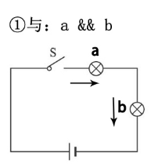
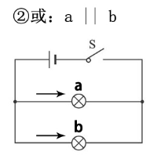

# JavaScript 第二天

## 复习

Javascript： ECMAScript， BOM， DOM

引入js： 行内式， 内嵌式， 外链式

​	自上而下的顺序执行

alert		console.log

注释： //    /**/

语句 

字面量

​	数字字面量	

​		整型	10进制，8进制 0， 0O, 0o，16进制 0x， 0X 

​		浮点型	幂的形式		1.23e4

​		特殊值	Infinity	  NaN

​	字符串字面量	""  ''		```\" \' \\``` 	\n	\t

变量	var name;

​	关键字和保留字

​	赋值： name = value;

​	var name1 = val1, name2 = val2;

​	声明提升

## 一、数据类型

### 1.1 数据类型

不管是字面量、变量、函数、数组，这些都有自己的数据类型。

简单数据类型：

> ​	number 		数字类型，包括所有的整数、浮点数、特殊值	
>
> ​	string		字符串类型，所有的字符串都是字符串类型
>
> ​	boolean 		布尔类型，仅有两个值true 和 false
>
> ​	undefined 	undefined类型，变量未定义时的值，这个值自己是一种类型

​	注： 数字类型里：不再区分整数、浮点数、Infinity、NaN，都是Number类型。

复杂数据类型：object                 后面的课程我们细说，

​	注：null表示空对象，有的人也把null单独看成一种类型（后面细说）。

### 1.2 数据类型检测

typeof 	

​	操作符，typeof() 括号可以使用或者不使用

​	typeof本身是一个关键字，检测的数据可以写在空格后面。

变量数据类型：

​	JavaScript是一种动态类型语言(dynamically typed language)。

​	变量的类型根据内部的数据而确定的。

​	但是变量内容是可以变动，数据类型会根据内容的变化而变化。

```html
<!DOCTYPE html>
<html lang="en">
<head>
    <meta charset="UTF-8">
    <meta name="viewport" content="width=device-width, initial-scale=1.0">
    <title>Document</title>
</head>
<body>
<script>
// 变量
// 数字
var a = 100,
    // 字符串
    b = 'hello',
    // 布尔值
    c = true,
    // undefined
    d;

// // 打印结果
// console.log(a);
// console.log(b);
// console.log(c);
// console.log(d);

// // 查看数据类型
// // typeof 可以是关键字
// console.log(typeof a);
// // 还可以是方法： 后面加上()
// console.log(typeof(b));
// console.log(typeof c);
// console.log(typeof d);

// 其它数据
console.log(typeof true);
console.log(typeof false);

console.log(typeof undefined);

console.log(typeof 'hello');
console.log(typeof "ickt");
console.log(typeof '100');
console.log(typeof '0.12');

// 数字
console.log(typeof 100);
console.log(typeof 0.12);
console.log(typeof 1.23e4);
console.log(typeof -20);
console.log(typeof Infinity);
console.log(typeof NaN);


</script>
</body>
</html>
```


### 1.3 数据类型转换

数字转字符串（数字＋空字符串。）：

​	加号：在不同数据类型之间使用时，尤其是数字和字符串类型，加号表示连接符，将数字和字符串拼接，得到的结果是字符串。

​	注：数字与数字类型之间，就是正常的运算符。

字符串转数字：

​	有2 个函数可以把非数值转换为数值：parseInt()和parseFloat()。

```html
<!DOCTYPE html>
<html lang="en">
<head>
    <meta charset="UTF-8">
    <meta name="viewport" content="width=device-width, initial-scale=1.0">
    <title>Document</title>
</head>
<body>
<script>
// 将数字转成字符串
var num = 100;
var num2 = 200;
var str = 'hello';

// 拼接在一起
// var result = num + str;
// 在运算的时候转换的也称之为隐形转换。
// var result = str + num;
// 数字的加法
var result = num + num2;
console.log(result)
console.log(typeof result)
</script>
</body>
</html>
```


### 1.4 parseInt

​	parseInt也有两个参数，

​		第一参数是要转的字符串（可以省略前缀）

​		第二个是进制（0，10以及默认值都是10位，最多36位）

​	parseInt作用：可以对数字进行取整。

​	进制的问题：由于ECMAScript 3 和 5存在着分歧，调用 parseInt()方法时最好总是带上进制(radix) 参数，这个参数用于指定使用哪一种进制。

如果指定了进制，那字符串前可以不带前缀“0”、“0o”、“0x”。

### 1.5 parseFloat

​	将字符串转为浮点数。

​	就是将字符串转换为浮点数，直接省略第一个小数点后其他非数字的东西。

```html
<!DOCTYPE html>
<html lang="en">
<head>
    <meta charset="UTF-8">
    <meta name="viewport" content="width=device-width, initial-scale=1.0">
    <title>Document</title>
</head>
<body>
<script>
// console.log(typeof '100');
// // console.log 可以传递多个参数，参数之间用逗号隔开
// // parseInt方法优先级高于typeof，因此会先执行
// console.log(parseInt('100'), typeof parseInt('100'));
// // 只能取整
// console.log(parseInt('123.456'), typeof parseInt('123.456'));
// // 会保留字母前面的数字
// console.log(parseInt('123abc456'), typeof parseInt('123abc456'));
// // 如果字母前面没有数字，将得到NaN
// console.log(parseInt('aaa123abc456'), typeof parseInt('aaa123abc456'));
// // parseInt会保留字母前面的或者是小数点掐面的。
// // 幂
// console.log(parseInt('1.23e4'), typeof parseInt('1.23e4'));

// // 对数字取整
// console.log(parseInt(1.23e4), typeof parseInt(1.23e4));
// 可以携带进制前缀,得到的结果是10进制的
// console.log(parseInt(011));
// console.log(parseInt(0O11));
// console.log(parseInt(0o11));
// console.log(parseInt(0X11));
// console.log(parseInt(0x11));
// // 第二个参数表示进制
// console.log(parseInt(11, 5));
// console.log(parseInt(11, 18));
// // 0和10以及默认值，都是10进制
// console.log(parseInt(11, 0));
// console.log(parseInt(11, 10));
// console.log(parseInt(11));
// // 1以及负数将得到NaN
// console.log(parseInt(11, 1));
// console.log(parseInt(11, -1));
// // 最多36进制
// console.log(parseInt(11, 36));
// console.log(parseInt(11, 37));
// // 如果前面有前缀，不要添加进制
// console.log(parseInt(011, 6));

// // 处理小数
// console.log(parseFloat('1.23'));
// console.log(parseFloat('1.23.456'));
// console.log(parseFloat('1.23abc'));
// console.log(parseFloat('abc1.23abc'));
// // 数字
// console.log(parseFloat(123));
// console.log(parseFloat(1.23e4));
// console.log(parseFloat(1.23e-4));
// console.log(parseFloat(0x11));
// // 第二个参数无意义，不是表示进制
// console.log(parseFloat(11, 12));

// +可以将字符串转成数字(隐形转换)
console.log(+10)
// +出现在字符串的前面，会将字符串转成数字
console.log(typeof '10', typeof +'10', +'10')
// 可以包含小数
console.log(typeof +'10.123', +'10.123')
// +只能隐形的转换正确的数字（只有一个小数点）
console.log(+'10.123.456')
console.log(+'1.123e4')
console.log(+'1.1a23e4')
console.log(+'011')
console.log(+'0O11')
console.log(+'0x11')
// 工作中，不太注意转换细节的时候，可以使用+转换
// +作用
// 表示正数符号         +10
// 字符串片接符号       'abc' + 'efg'
// 数字加法             5 + 6
// 数字的隐形转换       +'123'

</script>
</body>
</html>
```


## 二、运算符

### 2.1 运算符分类

运算符（Operators，也翻译为操作符），是发起运算的最简单形式。

分类：

> ​	数学运算符(Arithmetic operators)	
>
> ​	比较运算符(Comparison operators)
>
> ​	逻辑运算符(Logical operators)
>
> ​	赋值运算符(Assignment operators)
>
> ​	按位运算符(Bitwise operators)
>
> ​	条件 (三元) 运算符(Conditional operator)

### 2.2 数学运算符

数学运算符：  + - * / % ()

运算顺序：先算乘除取余，再算加减，遇见小括号先算小括号。

特殊运算：我们通常都是进行数字与数字的运算，我们还会进行一些特殊的数学运算。

​	纯数字字符串与数字进行运算的时候，纯数字字符串会被隐式转换为数字， 参与运算，加法除外。

​	除了纯数字之外，还有布尔值和null会被隐式转换。

隐式转换:不用parseInt和parseFloat，自动将字符串转成了数字

​	记忆：true→1	false→0	      null→0	“123”→123

​	undefined，或者非纯数字字符串不会被隐式转换，得到的结果都是NaN

总结：

> ​	纯数字字符串与数字进行除加法之外的数学运算时，都能进行隐式转换。
>
> ​	特殊字符，布尔值，null与数字进行计算时，所有的数学运算中都能被隐式转换。
>
> ​	非纯数字字符串和undefined，不能进行隐式转换，与任何数字进行运算得到都是NaN。
>
> ​	任何数字和NaN进行运算，得到都是NaN。

```html
<!DOCTYPE html>
<html lang="en">
<head>
    <meta charset="UTF-8">
    <meta name="viewport" content="width=device-width, initial-scale=1.0">
    <title>Document</title>
</head>
<body>
<script>
// console.log(2 + 3);
// console.log(2 - 3);
// console.log(2 * 3);
// console.log(2 / 3);

// // 求余
// console.log(5 % 3);
// // 负数也可以求余
// console.log(-5 % 3);

// // 浮点数加减法
// // 所有的数据都是以二进制进行存储的
// // 例如 5 => 101
// // 原因：js中小数采用的是单精度浮点数的形式
// console.log(0.1 + 0.2);
// console.log(0.5 + 0.25);
// // 不免精确的问题：转成整数解决
// console.log((0.1 * 10 + 0.2 * 10) / 10);
// console.log(0.4 - 0.1);

// // 乘，除，求余优先级是一样的
// console.log(4 + 5 * 2);
// console.log(4 + 5 % 2);
// console.log(4 * 5 / 2 % 5);
// console.log(4 % 5 * 5 / 2);
// console.log(4 % (5 * 5 / 2));
// // 优先级相同由左到右的顺序执行。
// console.log(4 + 5 - 2);


// 转换
console.log(true + 1);
console.log(false + 1);
// null 表示空对象
console.log(null + 1);
// 字符串拼接优先级要高于数字的加法
console.log('123' + 1);
// 字符串没有乘法，因此会作为数字处理
console.log('123' * 2);
// NaN和undefined作为NaN处理，NaN不论做什么运算，其结果都是NaN
console.log(undefined + 2);
console.log(NaN + 2);
console.log('hello' * 2);
console.log(Infinity + 2);
console.log(Infinity - 2);

</script>
</body>
</html>
```


### 2.3 Math对象

Math对象是js内置一个功能强大的数学对象，里面包含了很所数学运算的属性和方法。

常用方法：

> ​	Math.random();		返回大于等于0小于1的一个随机数
>
> ​	Math.pow(num,power);   返回num的power次幂
>
> ​	Math.sqrt(num);		返回num的平方根
>
> ​	Math.PI				返回π的值

```html
<!DOCTYPE html>
<html lang="en">
<head>
    <meta charset="UTF-8">
    <meta name="viewport" content="width=device-width, initial-scale=1.0">
    <title>Document</title>
</head>
<body>
<script>
// 随机数
console.log(Math.random());
// 计算周长，半径是5 
console.log(2 * Math.PI * 5);
console.log(Math.PI);
// 幂
console.log(Math.pow(2, 4));
// 开方
console.log(Math.sqrt(100));
</script>
</body>
</html>
```


### 2.4 比较运算符

```
>		大于
<		小于
>=		大于等于
<=		小于等于
==		等于
!=		不等于
===		全等于
!==		不全等于
所有比较运算符参与的运算得到的结果都是返回布尔值。
	==，等于，判断两边关系的时候，它会尽可能去判断两边相等。
	===，全等于，判断的时候，会尽可能判断两边不等。除了判断值相等以外，还要判断数据类型是不是相同。
```

**特殊情况**：

​	特殊字符串与数字进行比较。

​		比较过程中：纯数字字符串会隐式转换为数字，true转为1,false转为0 ，null转为0，但是做相等和全等判断的时候，null不等于0.

​	字符串与字符串进行比较。比较的不是大小、长短，比较的是字符的Unicode编码顺序。顺序靠前的		小于顺序靠后的。

​		字符编码顺序：数字（45），大写字母（69），小写字母（97）。

​		如果第一个字符相同，要依次寻找后面的字母进行判断，直到判断出大小。

​	有NaN参与的特殊情况：

​	有Infinity参与的特殊情况：

```html
<!DOCTYPE html>
<html lang="en">
<head>
    <meta charset="UTF-8">
    <meta name="viewport" content="width=device-width, initial-scale=1.0">
    <title>Document</title>
</head>
<body>
<script>
// 比较运算符
// console.log(3 == '3')
// console.log(3 == '3a')
// console.log(30 == 30.00)
// console.log(30 == '30.00')
// console.log(30 === '30.00')
// console.log(3 >= 4)

// Infinity是变量，存储在同一个位置
// console.log(Infinity === Infinity)
// console.log(Infinity == Infinity)
// console.log(Infinity == Number.MAX_VALUE * 10)
// console.log(Infinity == Number.MAX_VALUE)
// console.log(Infinity == -Infinity)

// NaN, +0, -0
// console.log(NaN === NaN)
// console.log(0/1 === 0/-1)

// NaN不等于任何数字
// console.log(0 == NaN)

// null 比较的时候不会转成0
// 理解为转成布尔会做比较的
// console.log(null == undefined)
// console.log(null === undefined)

// 都转成数字
// console.log(false == undefined)
// console.log(false === undefined)

// console.log(false == 0)
// console.log(false === 0)

// console.log(true == 1)
// console.log(true == 2)

// console.log(+true);
// console.log(+false);
// console.log(+null);
// console.log(+undefined);
// console.log(+undefined == undefined);
// console.log(NaN == undefined);
// console.log(false == 0);
// console.log(null == 0);

// 字符串比较
console.log('abcd' < 'efg');
console.log('123' < 'efg');
console.log('abc' < 'abce');
console.log('abch' < 'abce');

</script>
</body>
</html>
```


### 2.5 逻辑运算符

逻辑运算符常用于布尔类型值之间; 当操作数都是布尔值时，返回值也是布尔值。

​	&&	逻辑与运算符

​	||	逻辑或运算符

​	!	逻辑非运算符

特殊情况：

​	其它非布尔值也可以参与逻辑运算，参与的时候，会自动转换成布尔值进行运算，返回的结果就不一定是布尔值。

​	NaN、0、null、“”、undefined会转换成false参与运算。

​	非0 数字、非空字符串都会转成true参与运算。

注意：&& 优先级高于 ||，建议在工作中，用()提高优先级，避免语义问题

### 2.6 短路语法

**逻辑与&&**

​	将逻辑与比喻成串联电路，判断过程，想象成电流通过的过程。

​	电流通过：

- ​		如果a为真，电流能够通过流通到b，结果就是b；
- ​		如果a为假，电流不能通过，停留在a，结果为a。



**逻辑或||**

​	将逻辑或比喻成并联电路，判断过程，想象成电流通过的过程。

​	电流通过：

- ​		如果a为真，电流直接从a完成循环，结果为a；
- ​		如果a为假，电流从a不能经过，流经到b，我们结果是b。




练习1：	false || !false && false || true;

练习2：	4 && "hello" || !false || !true && null;

```html
<!DOCTYPE html>
<html lang="en">
<head>
    <meta charset="UTF-8">
    <meta name="viewport" content="width=device-width, initial-scale=1.0">
    <title>Document</title>
</head>
<body>
<script>
// 与，或，非
// console.log(true && true)
// console.log(true && false)
// console.log(true || false)
// console.log(false || false)
// console.log(!true)
// console.log(!false)

// !!可以将任何数据转成布尔值。
// console.log(!!false);
// 对任何数据求布尔值
// console.log(!!0);
// console.log(!!'');
// console.log(!!NaN);
// console.log(!!null);
// console.log(!!undefined);
// console.log(!!false);
// // 其余的数据，转成布尔值都是true
// console.log(!!Infinity);
// console.log(!!100);
// console.log(!!'hello');

// // 短路语法
// console.log('hello' && 100);
// console.log(0 && 100);
// // 逻辑或
// console.log('hello' || 100);
// console.log(0 || 100);

// 联系
// console.log(false || !false && false || true);  // true
// console.log(false || !false && false || 100);   // 100
// // console.log(false || (!false && 200) || 100);     // 200
// console.log(false || false && 200 || 100);      // 100
// console.log(false || (false && 200) || 100);      // 100

// console.log(4 && "hello" || !false || (!true && null));
console.log(4 && "hello" || !false || !true && null);


</script>
</body>
</html>
```


### 2.7 赋值运算符

赋值运算符是用右边的数据值为左侧的变量赋值。最简单的赋值运算符是等于（=），将右边的操作数值赋给左边的操作数（变量）。那么 x = y 

就是将 y 的值赋给 x。

含义：将右侧的数据运算之后，赋值给左边。

> ​	=		直接赋值，将等号右侧值直接赋值给左侧的变量
>
> ​		在变量原基础上，进行右侧的运算，将运算的值再赋值给左边的变量。
>
> ​	+=		加等于
>
> ​	-=		减等于
>
> ​	*=		乘等于
>
> ​	/=		除等于
>
> ​	%=		取余等于
>
> ​	++		递加
>
> ​	--		递减

**顺序**：贴身的（! ++ --）→ 数学 → 比较 → 逻辑 → 赋值

练习1：

​	var a = 4;

​	var sum = 1 * (2 + 3) && a++ || 5 > 6 && 7 < 8 || 9;

练习2：

​	var a = 4;

​	1 + 2 && 3 * a++ % 5 || 6 < 7 == 8 / !false

```html
<!DOCTYPE html>
<html lang="en">
<head>
    <meta charset="UTF-8">
    <meta name="viewport" content="width=device-width, initial-scale=1.0">
    <title>Document</title>
</head>
<body>
<script>
// 赋值
var a = 10;
// 让a加上5；
// a = a + 5;
// 简便写法
// a += 5;
// a -= 5;
// a *= 5;
// a /= 5;
// a %= 5;
// 让a加一或者减一
// a = a + 1;
// 简写
// a++
// a--
// 还可以写在变量前面
// ++a
// --a;
// 自加自减运算符会返回原来的变量
// console.log(a);
// console.log(++a);
// console.log(a++);
// console.log(a);

// ++ 或 -- 写在前面，会先运算，后返回变量
// ++ 或 -- 写在后面，会先返回变量，后运算

// var a = 4;
// var sum = 1 * (2 + 3) && a++ || 5 > 6 && 7 < 8 || 9;
// // sum = 5 && 4 || false && true || 9;
// console.log(sum);

var a = 4;
// 1 + 2 && 3 * 4 % 5 || 6 < 7 == 8 / true
// 1 + 2 && 2 || 6 < 7 == 8 / 1
// 3 && 2 || 6 < 7 == 8
// 3 && 2 || false
console.log(1 + 2 && 3 * a++ % 5 || 6 < 7 == 8 / !false);

// 1 + 2 && 3 * 4 % 5 || 6 < 7 == 8 / true
// 3 && 2 || 6 < 7 == 8
// 3 && 2 || false

</script>
</body>
</html>
```

