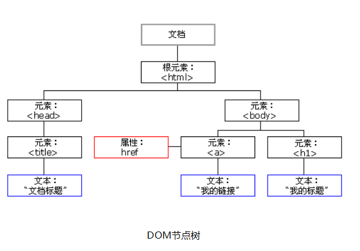

# JavaScript 第九天

## 一、正则表达式

### 1.1 预定义类

预定一类表示一类字符，是一些特殊字符集的简写。是js提前给我们定义好的

​	.	[^\n\r] 表示除了换行和回车之外的任意字符。

​	\d	[0-9]		表示数字字符。

​	\D	[^0-9]		表示非数字字符。

​	\s	[ \t\n\x0B\f\r]      表示空白字符。

​	\S	[^ \t\n\x0B\f\r]	 表示非空白字符

​	\w	[a-zA-Z_0-9]	 表示单词字符(所有的字母/数字/下划线)。

​	\W	[^a-zA-Z_0-9]	 表示非单词字符

​	匹配中文：[\u4e00-\u9fa5]，是一个固定用法，中文只能在正则表达式里这样表示。

```html
<!DOCTYPE html>
<html lang="en">
<head>
    <meta charset="UTF-8">
    <meta name="viewport" content="width=device-width, initial-scale=1.0">
    <title>Document</title>
</head>
<body>
<script>
// 1检测是否是本地电话，如010-12345678,0418-1234567
// var reg = /[0-9]{3}-[0-9]{8}|[0-9]{4}-[0-9]{7}/
// \d代表数字
// var reg = /\d{3}-\d{8}|\d{4}-\d{7}/;
// console.log(reg.test('0418-1234567'));

// | 表示或，可以应用在分组中，实现局部或
// var a = 'abcafg';
// var reg = /a(bc)|a(fg)/g;
// 使用局部或
// var reg = /a(bc|fg)/g;
// console.log(a.replace(reg, 'a**'))
// 测试是不是图片  .gif, .png, .jpg, .css, .js, .html
// var reg = /\.(jpg|gif|png)/
// console.log(reg.test('a.png'));
// console.log(reg.test('b.html'));

// 匹配中文
var reg = /[\u4e00-\u9fa5]+/g

console.log(reg.test('hello'));
console.log(reg.test('你好'));
</script>
</body>
</html>
```


### 1.2 分组

用于处理多个重复的数据，通过()定义分组

​	分组的意义就是我们可以捕获它们（引用它们）

分组的反向引用

​	表示正则表达式匹配的字符串再次进行使用。\编号（正则表达式中使用），$编号（在正则表达式外使用）。编码从1开始，依次进行分组的

编码。1,2,3……

​	一个分组就是一个编码。只能在正则使用。

非捕获组：不会创建反向引用的分组

​	(?=exp)	表示其后紧接指定字符串的字符串

​	(?!exp)	表示其后没有紧接字符串的字符串

或操作符：|表示可能性，如 a|b|c

​	在分组中，使用或，可以实现局部或

```html
<!DOCTYPE html>
<html lang="en">
<head>
    <meta charset="UTF-8">
    <meta name="viewport" content="width=device-width, initial-scale=1.0">
    <title>Document</title>
</head>
<body>
<script>
// 密码：包含字母和数字
// 特点： 字母在前或者数字在前      adf%^&123       123^^*sdf
// var reg = /[a-zA-Z][^0-9a-zA-Z]*[0-9]|[0-9][^0-9a-zA-Z]*[a-zA-Z]/;
// console.log(reg.test('asdfsadf'));
// console.log(reg.test('123213'));
// console.log(reg.test('asfd123213'));
// console.log(reg.test('123213(&(*afd'));

// 1检测是否是本地电话，如010-12345678,0418-1234567
// 特点：前面是3位，后面是8位，或者 前面是4位后面是8位
// var reg = /[0-9]{3}-[0-9]{8}|[0-9]{4}-[0-9]{7}/
// console.log(reg.test('010-12345678'));
// console.log(reg.test('0418-1234567'));
// console.log(reg.test('010-1234567'));

// // 交换两个乘数位置
// var str = 'hello:123*456';
// // 456*123
// // 通过分组，将两个数字拆开
// // 第二个参数是一个函数，返回值就是替换的内容
// // console.log(str.replace(/([0-9]+)\*([0-9]+)/, function(match, $1, $2) {
// //     // console.log(arguments);
// //     // return 100
// //     return $2 + '*' + $1
// // }));
// // replace函数中只有返回值，可以直接写
// // 外部捕获用$
// // console.log(str.replace(/([0-9]+)\*([0-9]+)/, '$2*$1'))
// // 在内部捕获用\
// 注意，内部匹配，只能匹配前后值一样的
var str = 'hello:123*123';
// var str = 'hello:123*12';
console.log(str.replace(/([0-9]+)\*(\1)/, '$1+$2'))
// \1代表分组的内容（不包括圆括号，不会被分组，想分组要再外面加上()）
// console.log(str.replace(/([0-9]+)\*\1/, '$1+$2'))

// 从左向右查找圆括号，是几序号就代表几

// 交换两个乘数位置
var str = 'hello:123*456*789';
// 456*123
// 通过分组，将两个数字拆开
console.log(str.replace(/([0-9]+)\*([0-9]+)\*([0-9]+)/, '$2*$1+$3'))


// function add(fn) {
//     fn(100, 200)
// }
// add(function($1, $2) {
//     console.log($1, 111, $2)
// })

</script>
</body>
</html>
```


## 二、定时器

### 2.1 单次定时器

间隔一段时间后异步执行。

​	异步：脱离程序主线程，单独执行，不会堵塞后面程序的执行。

​	启动单次定时器：setTimeout			

​	清除单次定时器：clearTimeout

### 2.2  循环定时器

​	每一段时间，函数自动执行一次。

​		启动循环定时器：setInterval			

​		清除循环定时器：clearInterval

​	setTimeout与setInterval的参数需要两个

​		第一个参数：每一段时间要做的事情书写在函数内部。可以是匿名函数或者是函数名。

​		第二个参数：函数间隔多少时间。单位是ms。不用书写单位 1s = 1000ms

​		从第二个参数开始，表示传递给第一个参数函数的数据，

​		定时器调用对象是window。但是一般不用书写window.表示页面加载之后立即调用定时器。

​	clearTimeout与clearInterval参数：定时器的名字。

重新开启循环定时器时，一定要先清除原有定时器，否则会造成定时器叠加。

```html
<!DOCTYPE html>
<html lang="en">
<head>
    <meta charset="UTF-8">
    <meta name="viewport" content="width=device-width, initial-scale=1.0">
    <title>Document</title>
</head>
<body>
<script>
// 单次定时器
// console.log('start')
// // 过两秒钟打印hello
// // setTimeout(function() {
// //     console.log('hello')
// // }, 2000)
// // 传递具名函数
// // function demo() {
// //     console.log('hello')
// // }
// // setTimeout(demo, 2000)
// // 从第二个参数开始，表示传递的数据
// var timebar = setTimeout(function() {
//     console.log('hello', arguments)
// }, 2000, 'ickt', 100, true)
// // 清空定时器
// clearTimeout(timebar)
// // 定时器是异步的，不会堵塞后面程序的执行
// console.log('end')


// 循环定时器
console.log('start')
// 每隔1秒钟打印hello
// setInterval(function() {
//     console.log('hello')
// }, 1000)
// 传递具名函数
// var demo = function() {
//     console.log('hello')
// }
// setInterval(demo, 1000)
// 给回调函数传递参数
// 回调函数：给方法传递的参数函数就是回调函数。
var timebar = setInterval(function() {
    console.log('hello', arguments)
}, 1000, 100, false, 'abc')
// 中断执行
clearInterval(timebar)
// 定时器是异步的，不会堵塞后面程序的执行
console.log('end')

</script>
</body>
</html>
```


## 三、DOM

### 3.1 DOM 概述

我们前面学习的都是JS语言核心部分，也就是ECMAScript。一般都是在控制台、输出语句里操作，JS还包括DOM和BOM。

DOM（Document Object Model，文档对象模型）描绘了一个层次化的节点树，允许开发人员添加、移除和修改页面的某一部分。这使得

JavaScript操作HTML，不是在操作字符串，而是在操作节点，极大地降低了编程难度。

DOM对很多东西做了抽象，提供了丰富的API：取得元素、css样式、事件、运动、元素尺寸位置、节点操作等等。



### 3.2 HTML 操作

document：表示文档（表示整个页面）对象。document对象具有页面几乎所有的方法或者属性。

​	读取： document.title 页面的标题。

​	赋值：使用=进行赋值。

一般操作元素都是从获取元素开始的。

​	获取元素的方法： getElementById()     	通过id属性获取元素对象。

​		通过id属性得到的元素对象的数据类型是对象

​	通过元素对象操作属性

​		读取：可以通过对象的点方法得到属性名。

​		设置：用=进行赋值

​			点语法只能读取或者设置元素的自带有属性不能设置读取元素的自定义属性。

```html
<!DOCTYPE html>
<html lang="en">
<head>
    <meta charset="UTF-8">
    <meta name="viewport" content="width=device-width, initial-scale=1.0">
    <title>Document</title>
</head>
<body>
    <h1 id="app" title="hello" style="color: green;" class="demo" color="red">hello ickt</h1>
    <!-- id不要同名 -->
    <!-- <h1 id="app">hello ickt 222</h1> -->
<script>
// 修改标题
document.title = '爱创课堂';
// 获取标题
console.log(document.title)
// 获取head标签
console.log(document.head)
// 获取body标签
console.log(document.body)

// 获取h1元素
var app = document.getElementById('app');       // 获取第一个
// 早期为元素添加id的时候，会在js中创建一个同名变量
// console.log(app)
// console.log(a);
// 获取属性
console.log(app.id);
console.log(app.title);
// style获取的是对象
console.log(app.style);
// class要写成className， for要写成htmlFor
console.log(app.className);
console.log(app.color);
// 修改属性
app.title = 'ickt'
app.className = 'ickt'
app.id = 'ickt'
</script>
</body>
</html>
```


### 3.3 属性操作

属性操作方法

​	读取：getAttribute()  可以读取元素自带属性或者是自定义属性

​	设置：setAttribute();   设置元素自带属性或者是自定义属性

点语法和getAttribute()，setAttribute()区别：

​	1 点语法只能读取或者设置元素的自带有属性，getAttribute()，setAttribute()可以读取元素自带属性或者是自定义属性

​	2 点语法操作有些属性名需要改名字，getAttribute()，setAttribute()不用改名，是什么就直接书写什么。

> class → className		
>
> for → htmlFor
>
> rowspan → rowSpan	
>
> colspan → colSpan

​	3 style属性：通过点语法得到的style对象，而getAttribute()得到的是字符串。

​	4 点语法得到style可以继续打点。而getAttribute()得到的是字符串不能继续打点调用属性。

总结：除了自定义属性使用getAttribute()，其他所有情况都使用点语法。

### 3.4 DOM 事件

事件监听：我们计算机在解析我们JS代码的时候，会去看某一些元素身上是否添加了事件。并监听这些事件有没有被触发，如果触发就立即执行

相应的行为。

> onclick					 单击				
>
> ondblclick				双击
>
> onmouseenter		鼠标进入			
>
> onmouseleave		鼠标离开
>
> onmousedown		鼠标按下			
>
> onmouseup			鼠标弹起
>
> onfocus					获取焦点			
>
> onblur						失去焦点
>
> onload					加载完毕之后

元素绑定事件：元素.事件名 = fn。可以绑定匿名函数或者函数名（千万不要在函数名后面书写小括号）。

注意：

​	我们在body中书写js时，需要将js书写在所有html元素之后。当html元素加载完毕之后在执行js。

​	如果js书写在head标签中，必须书写onload事件，window.onload表示当html元素加载完毕之后执行内部的语句。

```html
<!DOCTYPE html>
<html lang="en">
<head>
    <meta charset="UTF-8">
    <meta name="viewport" content="width=device-width, initial-scale=1.0">
    <title>Document</title>
<script>
// window是一个全局对象，包含dom的一些API，例如可以通过window监听页面加载完成
window.onload = function() {
    // 绑定事件监听用户与页面之间的交互。
    var app = document.getElementById('app')
    var inp = document.getElementById('inp')
    console.log(app, inp)
    // 监听点击h1元素
    // app.onclick = function() {
    //     console.log('click h1')
    // }
    // // 多次绑定，会导致后面的覆盖前面的，
    // app.onclick = function() {
    //     console.log('click h1 2222')
    // }
    // 双击
    // function fn() {
    //     console.log('click h1')
    // }
    // app.ondblclick = fn;
    // 鼠标移入和移出
    app.onmouseenter = function() {
        console.log('mouseenter')
    }
    app.onmouseleave = function() {
        console.log('onmouseleave')
    }
    // 输入框
    inp.onfocus = function() {
        console.log('获取焦点');
    }
    inp.onblur = function() {
        console.log('失去焦点');
    }
}

</script>
</head>
<body>
    <h1 id="app" class="demo" color="red" style="color: green; background: pink;">hello ickt</h1>
    <input id="inp" type="text" style="padding: 10px; margin-top: 50px;">
<script>
// // 绑定事件监听用户与页面之间的交互。
// var app = document.getElementById('app')
// var inp = document.getElementById('inp')
// // 监听点击h1元素
// // app.onclick = function() {
// //     console.log('click h1')
// // }
// // // 多次绑定，会导致后面的覆盖前面的，
// // app.onclick = function() {
// //     console.log('click h1 2222')
// // }
// // 双击
// // function fn() {
// //     console.log('click h1')
// // }
// // app.ondblclick = fn;
// // 鼠标移入和移出
// app.onmouseenter = function() {
//     console.log('mouseenter')
// }
// app.onmouseleave = function() {
//     console.log('onmouseleave')
// }
// // 输入框
// inp.onfocus = function() {
//     console.log('获取焦点');
// }
// inp.onblur = function() {
//     console.log('失去焦点');
// }


</script>
</body>
</html>
<script>
    console.log('页面加载完成了');
</script>
```


### 3.5 getElementsByTagName

getElementById()和getElementsByTagName()都是兼容IE低版本。全线兼容。

​	getElementsByClassName()不兼容IE低版本。

​	getElementsByTagName()通过元素的标签名得到元素。

​		得到的是页面上所有的同种标签组成的类数组对象。

​			类数组中保存的每一个数据也是元素对象。

​			得到的类数组对象具有length属性。表示保存的同种标签的元素个数。

​			可以通过数组的索引值得到任何一个对象。

​		不管元素嵌套多深，getElementsByTagName("p")也可以查找。

​		类数组对象保存数据的顺序和标签之间的嵌套没有关系，和标签首次出现的顺序有关。

### 3.6 批量操作

不但document可以打点调用getElementsByTagName()，其它元素对象也都可以打点调用该方法。

​	还可以将多条语句连续书写。（getElementById只能被document调用，元素无法调用。）

通过getElementsByTagName("")得到的一定是类数组对象，即使只有一个元素也是类数组对象。想得到该元素对象，仍然需要书写索引值。

批量操作事件

​	通过getElementsByTagName()得到的是类数组对象，我们可以通过批量操作的方式给数组每一个元素添加相同事件。

​	案例：给元素批量添加点击事件，触发事件弹出该元素对象的索引值

​	注意：事件回调函数中，存储索引值有两种方式

​		1 利用IIFE和闭包实现对数据的存储

​		2 通过this访问元素自身，再获取数据

```html
<!DOCTYPE html>
<html lang="en">
<head>
    <meta charset="UTF-8">
    <meta name="viewport" content="width=device-width, initial-scale=1.0">
    <title>Document</title>
    <style>
        div {
            font-size: 30px;
        }
    </style>
</head>
<body>
    <!-- <section id="app">
        <div>1
            <div>2
                <div id="div3">3
                    <div>4</div>
                </div>
            </div>
        </div>
    </section> -->
    <div>1</div>
    <div>2</div>
    <div>3</div>
    <div>4</div>
    <div>5</div>
    <div>6</div>
    <div>7</div>
<script>
// // 获取页面中所有div
// var divs = document.getElementsByTagName('div');
// // 遍历divs
// for (var i = 0; i < divs.length; i++) {
//     // 类数组对象，可以通过每一个索引值访问数组成员。
//     console.log(divs[i]);
// }
// console.log(divs)

// 后去section元素
// var app = document.getElementById('app');
// 通过app寻找其内部的div元素
// var divs = app.getElementsByTagName('div');
// console.log(divs)
// getElementById只能被document调用，元素无法调用。

// console.log(document.getElementsByTagName('section'));

// 批量的绑定事件
var divs = document.getElementsByTagName('div');
// 绑定事件
// for (var i = 0; i < divs.length; i++) {
//     // 绑定事件
//     divs[i].onclick = function() {
//         console.log(i)
//     }
// }
// 方案一 IIFE和闭包
// for (var i = 0; i < divs.length; i++) {
//     // 绑定事件
//     divs[i].onclick = (function(a) {
//         return function() {
//             console.log(a)
//         }
//     })(i + 1)
// }
// 方案二 通过this获取
// for (var i = 0; i < divs.length; i++) {
//     // 为元素添加一个属性，存储数据
//     // 获取的元素是对象，因此可以添加属性。
//     divs[i].index = i + 1;
//     // 绑定事件
//     divs[i].onclick = function() {
//         // this指向函数调用者，就是元素。
//         // console.log(this)
//         // 通过this访问元素。再访问属性
//         console.log(this.index)
//     }
// }

// 方案三 
for (var i = 0; i < divs.length; i++) {
    // 绑定事件
    divs[i].onclick = function() {
        // 由于这个案例中，元素的内容与索引值等价，因此可以将内容看成是索引值
        console.log(this.innerHTML);
    }
}

</script>
</body>
</html>
```

